# 디자인 명세서 (Design Specification)

**프로젝트명**: Jobclaw  
**버전**: 1.0  
**작성일**: 2026-05-28  
**팀**: Team 7 — 41class 2026 Spring

---

## 1. 서론

### 1.1 Readership

본 문서는 Jobclaw 프로젝트에 참여하는 팀원(개발자, 디자이너), 지도 교수, 그리고 외부 코드 리뷰어를 대상으로 작성되었습니다. 소프트웨어 공학 수업의 설계 문서 요건을 충족하기 위해 작성되었으며, 독자가 기본적인 웹 개발 및 RESTful API에 대한 지식을 보유하고 있다고 가정합니다.

### 1.2 Scope

본 문서는 Jobclaw 모노레포 프로젝트의 전체 시스템 설계를 다룹니다.  
포함 범위:
- `apps/web` — Next.js 기반 프론트엔드 애플리케이션
- `apps/api` — Hono 기반 백엔드 REST API 서버
- `apps/cli` — 내부 CLI 도구 (jobclaw assessor)
- 공유 데이터베이스 스키마 (PostgreSQL + Prisma)

### 1.3 Objective

본 문서의 목표는 다음과 같습니다:
1. Jobclaw 시스템의 전체 아키텍처를 명세합니다.
2. 프론트엔드·백엔드 컴포넌트 간의 책임과 경계를 명확히 합니다.
3. 데이터베이스 모델 및 API 프로토콜을 정의합니다.
4. 테스팅 전략 및 개발 환경을 기술합니다.
5. 이후 개발 과정에서 일관된 설계 기준으로 활용될 수 있도록 합니다.

### 1.4 Document Structure

| 섹션 | 내용 |
|------|------|
| 2. 소개 | 시스템 개요, 다이어그램 도구, 프로젝트 범위 |
| 3. 시스템 아키텍처 (Overall) | 전체 시스템 구성도, 유스케이스 다이어그램 |
| 4. 시스템 아키텍처 (Frontend) | Next.js 페이지 구조, 컨텍스트, 라우트 가드 |
| 5. 시스템 아키텍처 (Backend) | Hono 라우트, 미들웨어, AI 연동 |
| 6. 프로토콜 디자인 | REST API 엔드포인트, 요청/응답 스키마, 인증 흐름 |
| 7. 데이터베이스 디자인 | ER 다이어그램, 엔티티 설명 |
| 8. 테스팅 계획 | 테스팅 정책, 커버리지 전략 |
| 9. 개발 계획 | 환경·도구, 제약 조건, 전제 및 의존성 |

---

## 2. 소개

### 2.1 Objectives

이 섹션은 Jobclaw 프로젝트가 해결하는 문제와 핵심 기능을 소개합니다. 시스템이 어떤 사용자를 대상으로 하며, 어떤 기술 스택으로 구성되는지에 대한 전반적인 맥락을 제공합니다.

**Jobclaw**는 두 종류의 사용자를 위한 채용 플랫폼입니다:

- **Developer (개발자)**: 이력서와 GitHub 리포지토리를 기반으로 AI가 코드 역량을 평가하고 포트폴리오 사이트를 자동 생성합니다.
- **Company (기업)**: 평가 점수로 정렬된 개발자 디렉토리를 검색하고 관심 후보를 쇼트리스트에 저장하며, 직접 이메일로 연락할 수 있습니다.

### 2.2 Applied Diagrams

#### 2.2.1 Used Tools

| 도구 | 용도 |
|------|------|
| **Mermaid** | 본 문서 내 모든 다이어그램 (ER, 유스케이스, 시퀀스, 컴포넌트, 플로우차트) |
| **Prisma Schema** | 데이터베이스 모델의 실제 소스 (`apps/api/prisma/schema.prisma`) |
| **OpenAPI / Scalar** | API 명세 자동 생성 (`/reference` 경로에서 서빙) |

#### 2.2.2 Diagram Types

본 문서에서 사용되는 다이어그램 유형:

| 다이어그램 | 목적 |
|-----------|------|
| System Diagram | 서비스 간 통신 구조 파악 |
| Use Case Diagram | 사용자 유형별 기능 범위 파악 |
| Component Diagram | 프론트엔드 페이지 및 컨텍스트 구조 |
| Sequence Diagram | API 호출 흐름 및 인증 절차 |
| ER Diagram | 데이터베이스 엔티티 관계 |

#### 2.2.3 Project Scope

Jobclaw는 다음 기능을 구현 범위로 합니다:

**개발자(Developer) 기능**
- Supabase 소셜 로그인 (GitHub OAuth)
- 이력서 업로드 및 AI 파싱
- GitHub 리포지토리 AI 추출
- 코드 역량 평가 (Assessment) 생성 및 점수 확인
- AI 포트폴리오 생성
- RevenueCat 기반 구독(Pro) 관리

**기업(Company) 기능**
- 개발자 디렉토리 검색 (평가 점수 기준 정렬)
- 개발자 상세 프로필 및 평가 이력 열람
- 쇼트리스트(북마크) 저장/삭제
- 이메일 컨택 (Resend API 경유)

#### 2.2.4 References

- [Next.js App Router Documentation](https://nextjs.org/docs/app)
- [Hono Framework](https://hono.dev)
- [Prisma ORM](https://www.prisma.io/docs)
- [Supabase Auth](https://supabase.com/docs/guides/auth)
- [RevenueCat Web SDK](https://www.revenuecat.com/docs/web)
- [Resend Email API](https://resend.com/docs)
- [OpenAI API](https://platform.openai.com/docs)

---

## 3. 시스템 아키텍처 - Overall

### 3.1 Objectives

전체 시스템의 구성 요소와 서비스 간 상호작용을 설명합니다. 외부 서비스, 내부 앱, 데이터 흐름의 경계를 명확히 합니다.

### 3.2 System Organization

Jobclaw는 **pnpm + Turborepo** 기반의 모노레포로 구성됩니다.

| 앱 | 기술 스택 | 포트 |
|----|----------|------|
| `apps/web` | Next.js 15, TypeScript, Tailwind CSS v4 | 3000 |
| `apps/api` | Hono, Zod-OpenAPI, Prisma, Node.js | 8080 |
| `apps/cli` | Node.js CLI (jobclaw assessor) | — |

#### 3.2.1 System Diagram

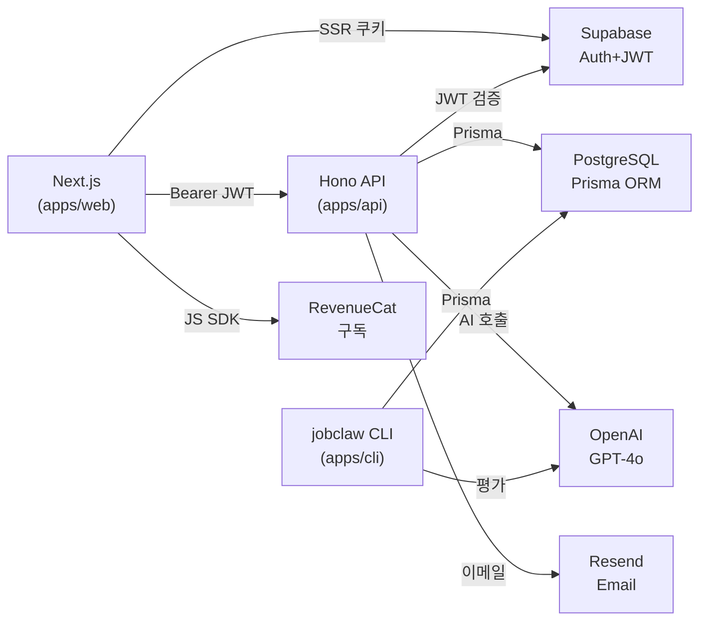

### 3.3 Use Case Diagram

**Developer Use Cases**

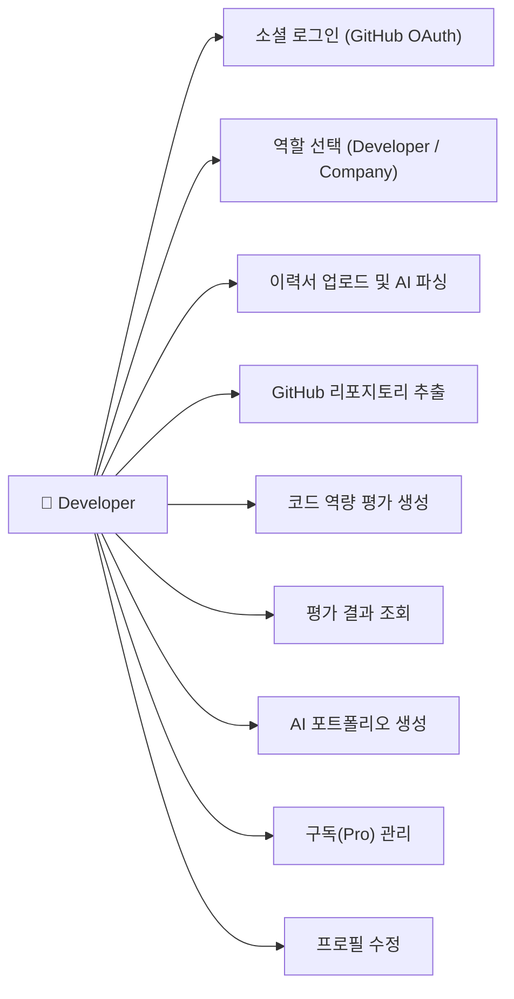

**Company Use Cases**

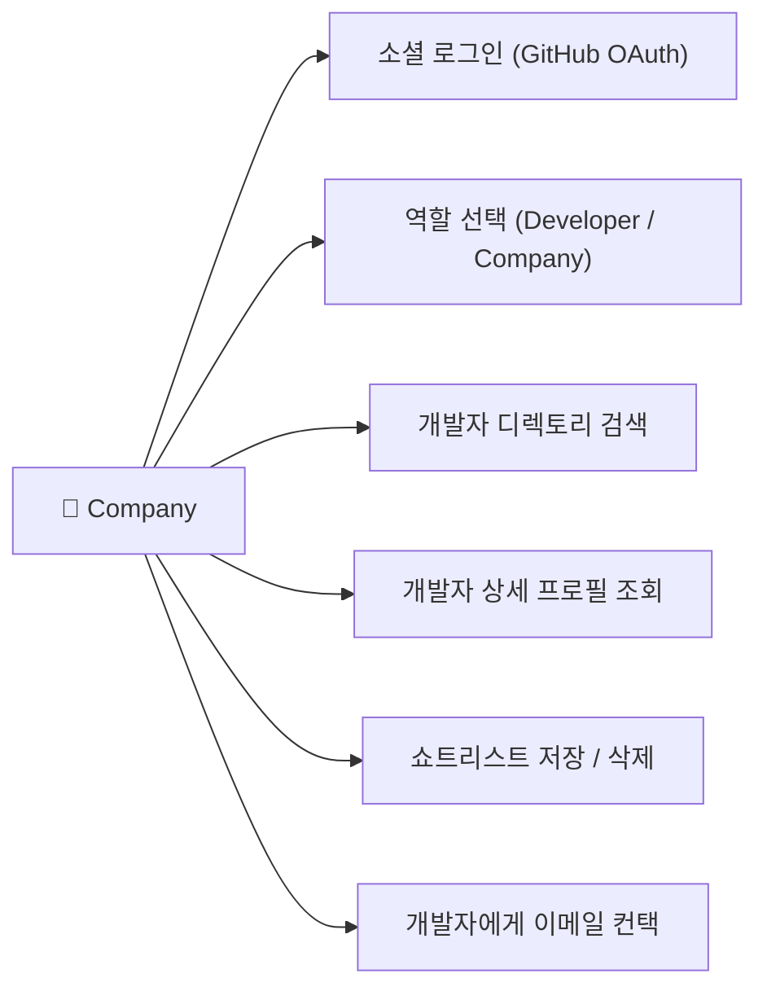

---

## 4. 시스템 아키텍처 - Frontend

### 4.1 Objectives

프론트엔드(`apps/web`)의 페이지 구조, 컨텍스트 관리, 라우트 가드 전략을 설명합니다.

#### 4.1.1 Components — 페이지 구조

Next.js App Router 기반으로, 모든 페이지는 `app/` 디렉토리 아래에 위치합니다.

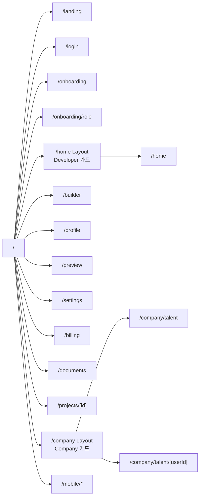

#### 4.1.2 Components — Context 구조

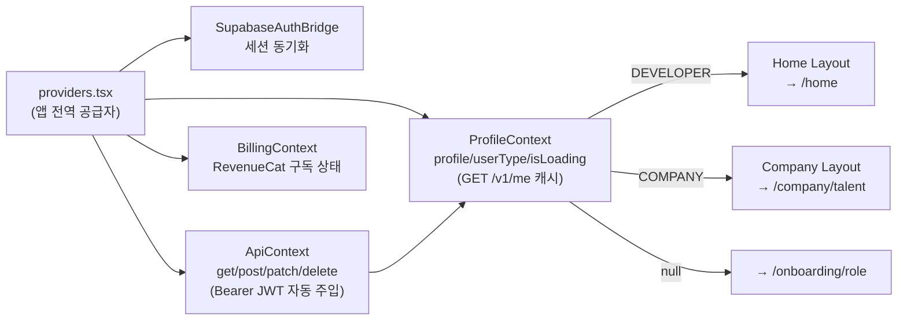

#### 4.1.3 Components — 라우트 가드 전략

| 레이아웃 | 파일 | 가드 조건 |
|---------|------|----------|
| `/home` layout | `app/home/layout.tsx` | `userType !== 'DEVELOPER'`이면 리다이렉트 |
| `/company` layout | `app/company/layout.tsx` | `userType !== 'COMPANY'`이면 리다이렉트 |
| 공통 | `ProfileContext` | `userType === null`이면 `/onboarding/role`로 이동 |

플래시 방지: 리다이렉트 판단이 완료되기 전까지 `null`을 렌더링하여 레이아웃 깜빡임을 방지합니다.

---

## 5. 시스템 아키텍처 - 백엔드

### 5.1 Objectives

백엔드(`apps/api`)의 계층 구조, 미들웨어 체인, 외부 서비스 연동 방식을 설명합니다.

### 5.2 Subcomponents

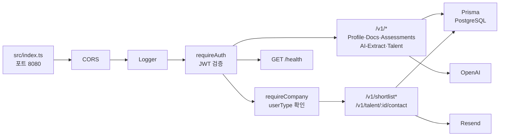

#### 5.2.1 미들웨어 상세

| 미들웨어 | 위치 | 동작 |
|---------|------|------|
| `requireAuth` | `src/middlewares/auth.ts` | Authorization 헤더의 Bearer JWT를 Supabase로 검증. 유효하면 `userId`를 컨텍스트에 저장. |
| `requireCompany` | `src/middlewares/require-company.ts` | DB에서 `Profile.userType`을 조회. `COMPANY`가 아니면 403 반환. |

#### 5.2.2 AI 연동 구조 (OpenAI)

Jobclaw는 네 가지 AI 기능에 OpenAI Chat Completions API를 사용합니다. 모든 기능은 `getOpenAI()` / `getOpenAIModel()` 유틸을 통해 환경 변수(`OPENAI_API_KEY`, `OPENAI_MODEL`)로 모델을 주입합니다.

| 기능 | 엔드포인트 | 모델 | temperature | response_format |
|------|-----------|------|-------------|-----------------|
| 이력서 파싱 | `POST /v1/ai-extract/resume` | GPT-4o | 0.2 | `json_object` |
| GitHub 추출 | `POST /v1/ai-extract/github` | GPT-4o | default | `json_object` |
| 코드 평가 저장 | `POST /v1/assessments` | (CLI가 생성, API는 저장만) | — | — |
| 포트폴리오 생성 | `POST /v1/portfolio/generate` | GPT-4o | default | `json_object` |

**① 이력서 파싱 흐름**

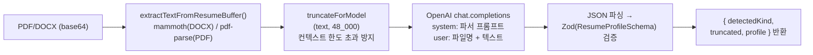

시스템 프롬프트가 반환할 JSON 스키마 (일부):
```json
{
  "fullName": "string|null",
  "headline": "string|null",
  "keySkills": "string[]",
  "workHistory": "[{ company, title, start, end, highlights }]",
  "confidence": "number (0–1)"
}
```

**② GitHub 리포지토리 추출 흐름**

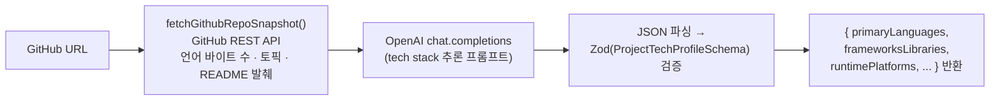

**③ 코드 역량 평가 (Assessment)**

평가 연산은 `apps/cli`(jobclaw CLI)가 담당하며, API는 결과를 저장하기만 합니다.

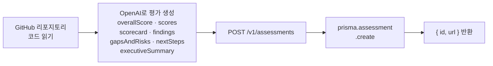

Assessment 결과 구조:
```json
{
  "overallScore": "number (0–100)",
  "scores": "{ [category]: number }",
  "scorecard": "{ [category]: { score, rationale } }",
  "findings": "string[]",
  "gapsAndRisks": "string[]",
  "nextSteps": "string[]",
  "executiveSummary": "string",
  "model": "string",
  "contextChars": "number"
}
```

**④ 포트폴리오 생성 흐름**

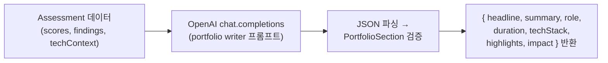

포트폴리오 시스템 프롬프트 규칙:
- `headline`: 8–14단어, 핵심 성과 강조
- `highlights`: 정확히 3–4개 항목
- `impact`: 측정 가능하거나 정성적인 결과 1–2문장

---

## 6. 프로토콜 디자인

### 6.1 Objectives

클라이언트–서버 간 통신 프로토콜을 정의합니다. 인증 흐름, 주요 API 엔드포인트의 요청/응답 형식, 에러 처리 규칙을 명세합니다.

### 6.2 인증 흐름 (Sequence Diagram)

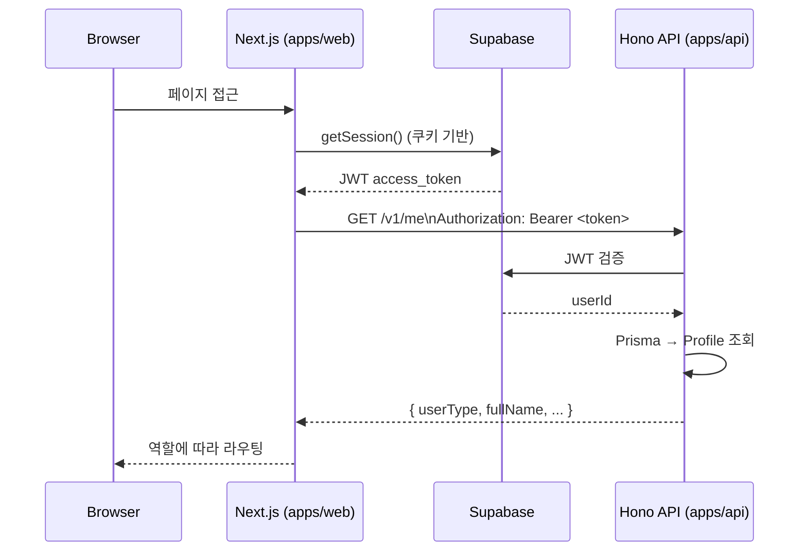

### 6.3 API 엔드포인트 목록

#### 공개 엔드포인트

| 메서드 | 경로 | 설명 |
|-------|------|------|
| `GET` | `/health` | 헬스체크 |
| `GET` | `/reference` | OpenAPI 문서 (Scalar UI) |

#### 인증 필요 (`/v1/*`)

| 메서드 | 경로 | 설명 |
|-------|------|------|
| `POST` | `/v1/bootstrap` | 최초 로그인 시 Profile 생성 |
| `GET` | `/v1/me` | 내 프로필 조회 |
| `PATCH` | `/v1/me` | 프로필 수정 (userType, companyName 등 포함) |
| `GET` | `/v1/documents` | 문서 목록 |
| `GET` | `/v1/invoices` | 인보이스 목록 |
| `POST` | `/v1/ai-extract/resume` | 이력서 AI 파싱 |
| `POST` | `/v1/ai-extract/github` | GitHub 리포지토리 AI 추출 |
| `POST` | `/v1/assessments` | 평가 생성 |
| `GET` | `/v1/assessments` | 내 평가 목록 |
| `GET` | `/v1/assessments/:id` | 평가 상세 |
| `POST` | `/v1/portfolio/generate` | 포트폴리오 생성 |
| `GET` | `/v1/talent` | 개발자 디렉토리 조회 |
| `GET` | `/v1/talent/:userId` | 개발자 상세 (평가 포함) |

#### Company 전용

| 메서드 | 경로 | 설명 |
|-------|------|------|
| `POST` | `/v1/talent/:userId/contact` | 개발자에게 이메일 발송 |
| `GET` | `/v1/shortlist` | 쇼트리스트 조회 |
| `POST` | `/v1/shortlist` | 쇼트리스트 추가 |
| `DELETE` | `/v1/shortlist/:userId` | 쇼트리스트 삭제 |

### 6.4 주요 요청/응답 스키마

#### `PATCH /v1/me` — 프로필 수정

**Request Body** (일부 필드 선택적):
```json
{
  "fullName": "string",
  "role": "string",
  "location": "string",
  "website": "string | null",
  "userType": "DEVELOPER | COMPANY",
  "companyName": "string | null",
  "industry": "string | null",
  "allowContact": "boolean"
}
```

**Response 200**:
```json
{
  "id": "string",
  "userId": "string",
  "fullName": "string",
  "userType": "DEVELOPER | COMPANY | null"
}
```

#### `GET /v1/talent` — 개발자 디렉토리

**Response 200**:
```json
{
  "items": [
    {
      "userId": "string",
      "fullName": "string",
      "role": "string",
      "location": "string",
      "website": "string | null",
      "allowContact": "boolean",
      "bestScore": "number",
      "assessmentCount": "number",
      "isShortlisted": "boolean"
    }
  ],
  "total": "number"
}
```

#### `POST /v1/talent/:userId/contact` — 개발자 컨택

**Request Body**:
```json
{
  "message": "string (10~2000자)"
}
```

**Response 200**:
```json
{ "ok": true }
```

### 6.5 AI API 호출 흐름 (Sequence Diagram)

이력서 파싱을 예시로 한 OpenAI 연동 시퀀스:

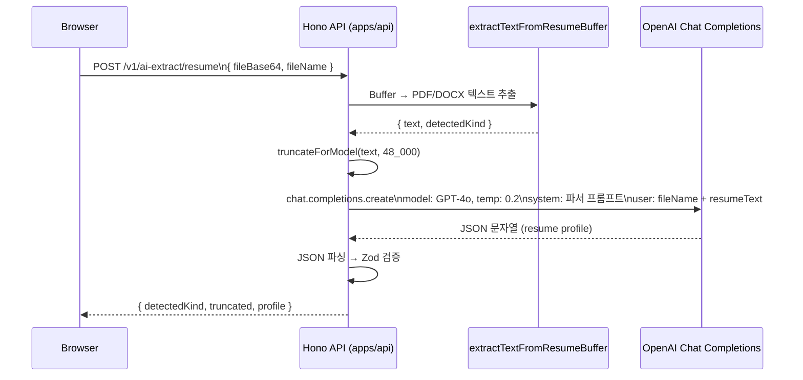

포트폴리오 생성 시퀀스:

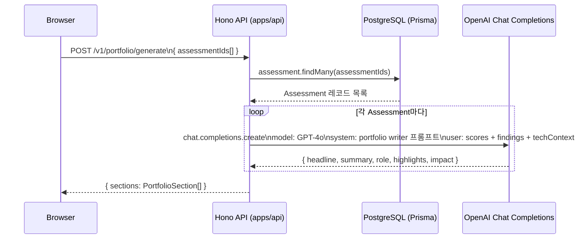

코드 평가(Assessment) 생성 시퀀스 (CLI 주도):

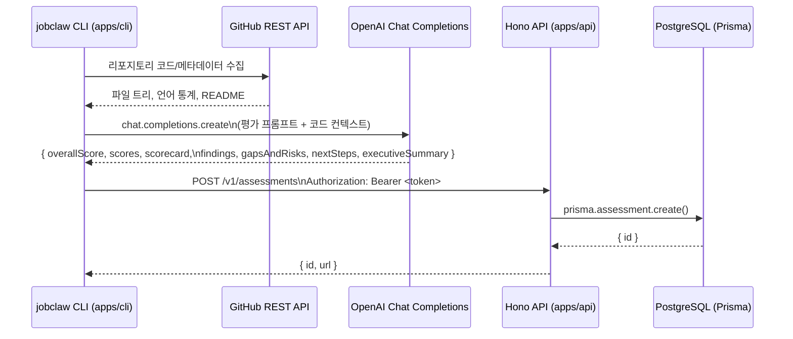

### 6.6 에러 처리 규칙

| HTTP 상태 | 의미 | 예시 |
|-----------|------|------|
| `400` | 잘못된 요청 (스키마 불일치) | 필수 필드 누락 |
| `401` | 미인증 | JWT 없음 / 만료 |
| `403` | 권한 없음 | Developer가 Company 전용 API 호출 |
| `404` | 리소스 없음 | 존재하지 않는 userId |
| `500` | 서버 오류 | DB 연결 실패, AI API 오류 |

모든 에러 응답 형식:
```json
{ "message": "에러 설명 문자열" }
```

---

## 7. 데이터베이스 디자인

### 7.1 Objectives

시스템에서 사용하는 데이터 모델의 구조와 엔티티 간 관계를 정의합니다. PostgreSQL을 Prisma ORM으로 접근하며, 모든 스키마 변경은 `prisma migrate dev`를 통해 관리됩니다.

### 7.2 ER Diagram

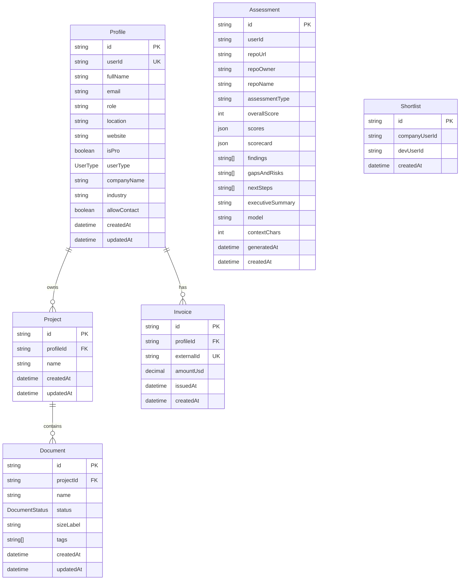

### 7.2.1 Entity Descriptions

#### Profile
사용자의 핵심 프로필 정보를 저장합니다. `userId`는 Supabase Auth의 UUID와 매핑됩니다. `userType`이 `DEVELOPER`이면 개발자로, `COMPANY`이면 기업으로 구분됩니다. `allowContact`가 `true`인 경우에만 기업이 컨택 이메일을 발송할 수 있습니다.

#### Project
개발자가 소유한 포트폴리오 프로젝트 단위입니다. GitHub 추출 또는 이력서 파싱으로 생성됩니다.

#### Document
프로젝트에 속한 개별 문서(이력서, 포트폴리오 섹션 등)입니다. 상태는 `ACTIVE`, `DRAFT`, `ARCHIVED` 중 하나입니다.

#### Invoice
RevenueCat 구독 결제와 연동된 인보이스 레코드입니다. `externalId`는 RevenueCat의 거래 ID입니다.

#### Assessment
GitHub 리포지토리에 대한 AI 평가 결과입니다. `overallScore`(0–100), 세부 `scores`(JSON), `scorecard`(JSON), 발견사항 목록, 개선점, 요약 등을 포함합니다. `userId`는 `Profile.userId`와 연결되지만 외래키 제약은 없습니다(성능 및 유연성 고려).

#### Shortlist
기업 사용자(`companyUserId`)가 북마크한 개발자(`devUserId`)의 관계를 저장합니다. `(companyUserId, devUserId)` 복합 유니크 제약으로 중복을 방지합니다.

### 7.2.2 Enum Types

| Enum | 값 |
|------|----|
| `UserType` | `DEVELOPER`, `COMPANY` |
| `DocumentStatus` | `ACTIVE`, `DRAFT`, `ARCHIVED` |

---

## 8. 테스팅 계획

### 8.1 Objectives

Jobclaw의 테스팅 전략과 품질 보증 정책을 정의합니다. 주요 비즈니스 로직의 정확성을 검증하고, 회귀(regression)를 조기에 탐지하는 것을 목표로 합니다.

### 8.2 Testing Policy

#### 테스팅 도구

| 도구 | 용도 |
|------|------|
| **Vitest** | API 서버 유닛/통합 테스트 |
| **TypeScript** (`tsc --noEmit`) | 정적 타입 검사 (컴파일 오류 조기 탐지) |
| **Next.js build** | 프론트엔드 빌드 성공 여부 검증 |

#### 테스트 위치

```
apps/api/
└── test/
    ├── company-feature.test.ts     # Company 기능 (patch-me, talent, contact, shortlist)
    └── extract-document-text.test.ts  # 문서 텍스트 추출 유틸
```

#### 테스트 전략

**1. 유닛 테스트 (Unit Tests)**  
- Prisma Client와 외부 서비스(Resend)를 `vi.mock()`으로 목업하여 격리된 핸들러 로직을 검증합니다.
- 각 라우트 핸들러를 독립된 Hono 앱 인스턴스에 마운트하여 요청/응답 사이클을 시뮬레이션합니다.

**2. 타입 검사 (Type Checking)**  
- `pnpm typecheck` (모든 앱) 를 통해 API–프론트엔드 간 타입 불일치를 사전에 차단합니다.

**3. 빌드 검증 (Build Verification)**  
- `pnpm build` 성공 여부로 Next.js 페이지의 정적 분석 오류를 확인합니다.

#### 실행 명령

```bash
# 전체 테스트
cd apps/api && npx vitest run

# 특정 테스트 파일
npx vitest run test/company-feature.test.ts

# 타입 검사
pnpm typecheck

# 빌드 검증
pnpm build
```

#### 테스트 커버리지 대상

| 영역 | 검증 항목 |
|------|----------|
| `PATCH /v1/me` | userType 설정, companyName 필드 처리 |
| `GET /v1/talent` | 정렬, isShortlisted 여부 반영 |
| `POST /v1/talent/:id/contact` | allowContact 미허용 시 403, Resend 호출 확인 |
| `POST /v1/shortlist` | 중복 방지, 정상 저장 |

---

## 9. 개발 계획

### 9.1 Objectives

Jobclaw 개발에 사용된 환경, 도구, 빌드 파이프라인을 정의하고, 알려진 제약 조건과 전제 사항을 기술합니다.

### 9.2 개발 환경

| 항목 | 상세 |
|------|------|
| OS | Linux (WSL2 권장) / macOS |
| Node.js | v20+ |
| 패키지 매니저 | pnpm 10.x |
| 빌드 오케스트레이터 | Turborepo |
| 언어 | TypeScript (strict mode) |
| 에디터 | VS Code (권장) |

### 9.3 Tools

| 도구 | 버전 | 용도 |
|------|------|------|
| Next.js | latest | 프론트엔드 프레임워크 |
| Hono | latest | 백엔드 API 프레임워크 |
| Prisma | ^6.x | ORM, 마이그레이션 |
| Supabase | ^2.x | 인증, 세션 관리 |
| OpenAI SDK | ^6.x | AI 기능 (GPT-4o) |
| Resend | ^6.x | 트랜잭션 이메일 |
| RevenueCat JS | ^1.x | 구독 결제 |
| Tailwind CSS | ^4.x | 스타일링 |
| Vitest | ^4.x | 테스트 프레임워크 |
| Turbo | latest | 모노레포 태스크 오케스트레이션 |

### 9.4 로컬 실행 방법

```bash
# 의존성 설치
pnpm install

# 환경 변수 설정 (.env at monorepo root)
# DATABASE_URL, SUPABASE_URL, SUPABASE_SERVICE_ROLE_KEY, OPENAI_API_KEY, RESEND_API_KEY, REVENUECAT_API_KEY

# DB 마이그레이션
cd apps/api && npx prisma migrate dev

# 전체 개발 서버 실행 (web:3000, api:8080)
pnpm dev
```

### 9.5 Constraints (제약 조건)

1. **AI API 비용**: OpenAI GPT-4o 호출은 토큰 소비가 크므로, 평가 생성(`POST /v1/assessments`)은 Pro 구독 사용자로 제한하는 것을 권장합니다.
2. **이메일 발송**: Resend 무료 플랜은 일 100건 제한이 있습니다. 기업 컨택 기능은 `allowContact === true`인 개발자에게만 발송됩니다.
3. **파일 업로드**: 이력서 파싱은 PDF 및 DOCX 형식만 지원합니다.
4. **인증**: Supabase GitHub OAuth에 의존하므로, GitHub 계정이 없는 사용자는 가입이 불가합니다.
5. **데이터베이스**: PostgreSQL만 지원합니다 (Prisma datasource provider).

### 9.6 Assumptions and Dependencies (전제 조건 및 의존성)

| 전제 / 의존성 | 설명 |
|--------------|------|
| Supabase 프로젝트 | 유효한 Supabase 프로젝트와 GitHub OAuth 앱이 설정되어 있어야 합니다. |
| PostgreSQL DB | `DATABASE_URL` 환경 변수로 접근 가능한 PostgreSQL 인스턴스가 필요합니다. |
| OpenAI API Key | GPT-4o 접근 권한이 있는 API 키가 필요합니다. |
| Resend API Key | 발신자 도메인이 Resend에 등록되어 있어야 합니다. |
| RevenueCat | 웹 SDK 엔타이틀먼트 설정이 RevenueCat 대시보드에 구성되어 있어야 합니다. |
| 인터넷 연결 | 외부 AI 및 이메일 서비스가 모두 클라우드 의존적입니다. |
