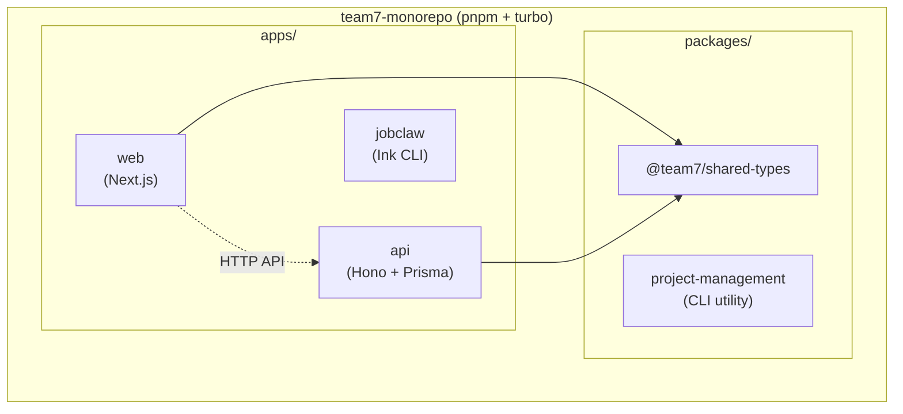
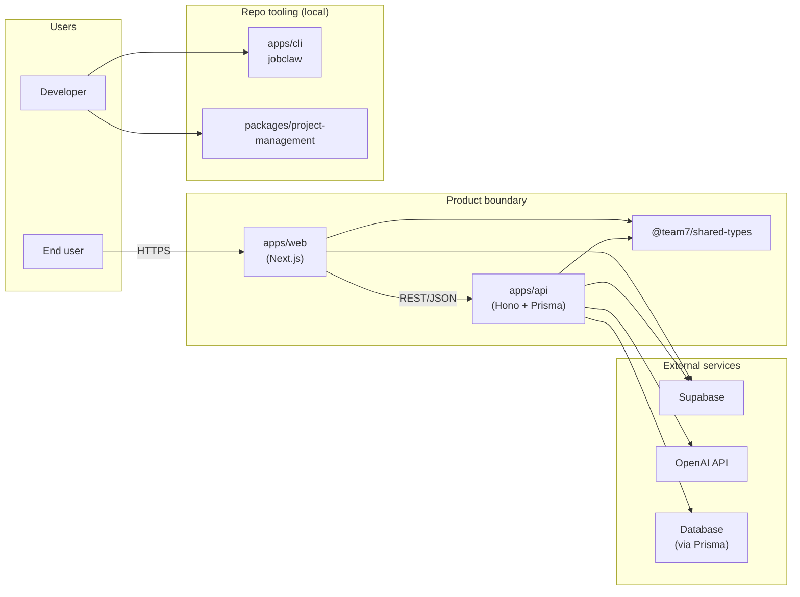
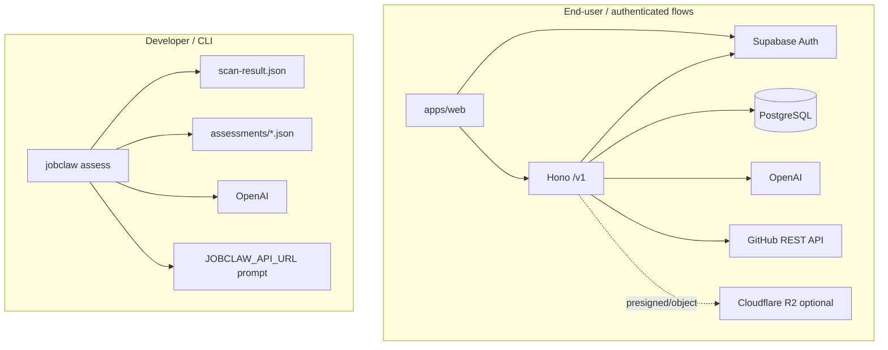

# Software Requirements Specification (SRS) — Team 7 Monorepo

**Reading guide.** Sections **1–3** state requirements in **plain language** so you do not need any other file to understand what the system must do. **Repository paths** (markdown prompts, handler source files, etc.) appear only in **§1.4 References**, **Appendix A** (summaries keyed by path), and **Appendix D** (path index).

---

## Monorepo projects

| Location | Package name | Role |
|----------|----------------|------|
| Root | `team7-monorepo` | pnpm workspace + Turbo orchestration (`pnpm`, `turbo`) |
| `apps/web` | `web` | Next.js web app (React, Tailwind, Supabase client, `@team7/shared-types`) |
| `apps/api` | `api` | Hono HTTP API (Prisma, OpenAPI/Zod, Supabase, OpenAI, document parsers) |
| `apps/cli` | `jobclaw` | Ink-based CLI (`jobclaw`) for repo assessment / dev workflows |
| `packages/shared-types` | `@team7/shared-types` | Shared TypeScript types (DTOs) consumed by `web` and `api` |
| `packages/project-management` | `project-management` | Standalone CLI (`projects` / `project-management`) for bookmarking local project paths |

---

## 1. Introduction

### 1.1 Purpose

This Software Requirements Specification (SRS) defines the intended behavior, boundaries, and context of **Jobclaw** and the software shipped in repository **`team7-monorepo`**: a TypeScript monorepo that delivers **Jobclaw** (CLI assessment tooling and related workflows), a **web client**, a **backend API**, the **`@team7/shared-types`** package for cross-app types, and additional **developer CLIs**. The document is written for:

- **Course / team stakeholders** evaluating scope and grading alignment
- **Developers** implementing or extending `apps/*` and `packages/*`
- **Reviewers** checking consistency between the API, web app, and shared types

### 1.2 Scope

**Product name:** **Jobclaw**. **Repository (workspace):** `team7-monorepo` (course designation: Team 7).

**In scope**

- **End-user product:** Browser-based experience implemented in **`apps/web`** (Next.js), communicating with **`apps/api`** (Hono) and backend services (e.g. Supabase, Prisma-backed persistence, document-related workflows reflected in the codebase).
- **Shared typing/API shapes:** **`packages/shared-types`** consumed by web and API for aligned request/response and domain types.
- **Engineering tooling shipped in-repo:** **`apps/cli` (`jobclaw`)** for repository assessment and related CLI workflows; **`packages/project-management`** as a separate CLI for managing saved local project paths (developer convenience, not part of the primary end-user web/API feature set unless explicitly integrated).

**Out of scope (unless added later)**

- Requirements for third-party services beyond what the repository actually integrates (e.g. specific SLAs of Supabase/OpenAI) except as constraints inherited by interface choices.
- Non-web clients (mobile native apps) — not present as separate apps in this workspace layout.

**Goals / benefits**

- Single codebase with **clear package boundaries** (apps vs packages), **type-safe shared types**, and **automated builds** via Turbo.

### 1.3 Definitions, acronyms, and abbreviations

| Term | Definition |
|------|------------|
| **Monorepo** | One repository containing multiple packages (`apps/*`, `packages/*`) with shared tooling. |
| **pnpm workspace** | pnpm feature declaring workspace packages; defined in `pnpm-workspace.yaml`. |
| **Turbo** | Task runner / cache layer for `dev`, `build`, `lint`, `typecheck` across packages. |
| **Next.js** | React framework used by `apps/web`. |
| **Hono** | Lightweight HTTP framework used by `apps/api`. |
| **Prisma** | ORM and migration tooling used by `apps/api`. |
| **Supabase** | Hosted Postgres/auth/storage SDK usage in `web` and `api` (as wired in the code). |
| **OpenAPI / Zod** | API schema and validation stack (`@hono/zod-openapi`, `zod`) in `apps/api`. |
| **jobclaw** | CLI binary from `apps/cli` for assessment-oriented workflows. |
| **Shared types package** | `@team7/shared-types` — shared types/modules for cross-package consistency. |
| **SRS** | Software Requirements Specification (this document’s genre). |

### 1.4 References

Normative requirements are fully expressed in **§§1–3** and summarized again in **Appendix A**. The table below is **traceability only**—paths into this repository for implementers and auditors. See **Appendix D** for a compact index of the same paths by topic.

| Document / artifact | Location / note |
|---------------------|-----------------|
| Workspace layout | `pnpm-workspace.yaml` — lists `apps/*`, `packages/*`. |
| Root scripts & tooling | `package.json` — `turbo` tasks, `pnpm` scripts. |
| Package manifests | `apps/web/package.json`, `apps/api/package.json`, `apps/cli/package.json`, `packages/shared-types/package.json`, `packages/project-management/package.json`. |
| Turbo pipeline | `turbo.json` — build outputs and task dependencies. |
| Internal architecture docs | `docs/cloudflare-r2-hono.md`, `docs/supabase-auth.md`, `docs/ai-openai-hono-extraction.md` |
| Jobclaw CLI | `apps/cli/Jobclaw-cli.md` |
| Prompt templates | `apps/cli/prompts/agents/local-repository-agent.prompt.md`, `apps/cli/prompts/assessments/node-backend-assessment.prompt.md` |

*(Add course syllabus, design docs, or published API spec URLs when available.)*

### 1.5 Overview

The remainder of a typical SRS would usually include:

- **§2 Overall description** — product perspective, functions, user classes, constraints, assumptions.
- **§3 External interface requirements** — U/I, hardware, software interfaces; functional, performance, and database requirements; quality attributes.
- **§4 Appendixes** — supporting material.

The following diagram summarizes **logical relationships** between major runtime components (illustrative; not a UI design).

---

## 2. Overall description

The opening paragraphs below (**through the OpenAI extraction paragraph**) give **standalone** context for Jobclaw, Supabase, R2, and AI routes—written so nothing else needs to be opened. **§2.1–2.5** build on that content without pointing to external files.

**Jobclaw CLI.** Jobclaw is a terminal tool that profiles a git checkout: it reads project history and manifests, optionally downloads an “evaluation prompt” from a remote API (`JOBCLAW_API_URL`, with offline fallback), sends bundled source excerpts to OpenAI for a general quality score, then runs a second pass using a fixed **Node.js backend** checklist (OpenAPI coverage, Zod validation, rate limiting, caching, Prisma models). Commands include **`init`** (accept terms/privacy, store OpenAI key under `~/.jobclaw/secrets.json` or use `OPENAI_API_KEY`), **`assess`** (writes `.jobclaw/scan-result.json` then `.jobclaw/assessments/*.json`), **`publish`** / **`publish-scan`** (records a local publish and prints a **jobclaw.fyi** URL pattern; quota of five successful publishes before a subscription prompt), **`doctor`** (validates setup), and **`projects`** (bookmark/open paths in `~/.jobclaw/jobclaw-projects.json`). This monorepo’s HTTP API does not implement Jobclaw’s publish upload yet.

**Local repository agent prompt.** This text is meant as a **system-style instruction** for an AI paired with real disk access: behave as a senior engineer at a resolved repository root, explore structure before concluding, read minimal file slices, avoid inventing APIs, never echo secrets, prefer diffs and small steps, and optionally append machine-readable JSON (intent, touched paths, blockers). It is not tied to a single product feature; it documents how automated or semi-automated reviews should behave when file context is injected.

**Node backend assessment prompt.** When Jobclaw runs the backend pass, the model must score five dimensions from **0–10** (OpenAPI/Swagger or zod-openapi style docs, Zod at route boundaries, rate limiting, caching, Prisma schema quality), combine into an overall score, and return structured JSON (scorecard rows, executive summary, findings, gaps, next steps). Scores are evidence-based from excerpts only; missing evidence implies low confidence.

**Supabase authentication.** The web app uses Supabase Auth with **HTTP-only cookies** via `@supabase/ssr`. The client sends `Authorization: Bearer <session.access_token>` to the API. The API calls `supabase.auth.getUser(jwt)` with the **anon** key (same Supabase project as the web app—never the service role in the browser). Next.js **middleware** refreshes sessions; OAuth returns via `/auth/callback`. Provider order matters so billing hooks receive user id and token. Sign-out clears the in-memory API token and resets billing user id as documented.

**Cloudflare R2 and Hono.** User-uploaded **bytes** can live in **R2** (S3-compatible API from Node using account ID and access keys); **PostgreSQL** remains authoritative for listing and metadata (e.g. a future `r2ObjectKey` on `Document`). Recommended pattern: API validates the user, creates/updates a DB row, returns a **short-lived presigned PUT** so the browser uploads directly to R2; alternatively the API proxies multipart uploads with strict size limits. Bucket stays private; keys are tenant-prefixed; CORS must allow the web origin for browser PUTs.

**OpenAI extraction (resume and GitHub).** Protected routes under `/v1/*` require the same bearer JWT. **`POST /v1/resume/parse`** accepts base64 PDF/DOCX (max **6 MiB** decoded), extracts text locally, truncates long text (~48k chars), calls OpenAI with `json_object` output, and validates **`ResumeProfile`** with Zod. **`POST /v1/projects/analyze-github`** takes a public GitHub URL, fetches repo metadata and README via GitHub’s API (optional `GITHUB_TOKEN`), then asks OpenAI for a structured **`ProjectTechProfile`**, validated on the server. Missing `OPENAI_API_KEY` yields **503**; bad upstream or invalid JSON yields **502** or documented 4xx codes.

### 2.1 Product perspective

The monorepo supports a **career / portfolio-oriented web product** plus **automation for developers**:

- **Motivation:** Give authenticated users a modern web UI (`apps/web`) backed by a typed HTTP API (`apps/api`) for profiles, projects, documents, billing-related data, and AI-assisted extraction (resume parsing, GitHub tech-stack inference). **Supabase JWT** bridges the browser and API; optional **Cloudflare R2** holds user file bytes with metadata in Postgres; **OpenAI** produces structured JSON for extraction features.
- **Developer tooling:** The **`jobclaw`** CLI (`apps/cli`) profiles a repository: git timeline, manifest-driven skill inference, optional remote **evaluation prompt** fetch (`JOBCLAW_API_URL`), OpenAI-based scoring, and a **Node.js backend** assessment rubric (OpenAPI, Zod, rate limiting, caching, Prisma—see the summary above). Publishing records **jobclaw.fyi** URL patterns locally; the HTTP API in this monorepo does not implement Jobclaw’s publish upload endpoint.
- **Effect:** End users get authenticated flows and API-backed features; engineers get repeatable repo scans and backend quality checks; shared **`@team7/shared-types`** keeps cross-package types aligned (currently minimal exported types—room to grow).

### 2.2 Product functions

Major capabilities (logical view—not screen design):

| Area | Functions |
|------|-----------|
| **Web (`apps/web`)** | Next.js UI; Supabase Auth (email/password, OAuth); session via cookies (`@supabase/ssr`); `Authorization: Bearer` to API; middleware refresh; RevenueCat wired via auth bridge for billing user id. |
| **API (`apps/api`)** | OpenAPI-described Hono routes; public `/health`, `/example`, `/doc`, `/ui`; **`/v1/*` protected** by `requireAuth` (Supabase JWT). Bootstrap, profile (`/v1/me`), documents list, invoices list, **`POST /v1/resume/parse`**, **`POST /v1/projects/analyze-github`**. |
| **Data** | PostgreSQL via Prisma (`Profile`, `Project`, `Document`, `Invoice`—see §3.4). Optional Cloudflare R2 for document bytes; Postgres remains authoritative for listings and metadata (including a future object key field). |
| **Jobclaw CLI** | `init` (legal + OpenAI key in `~/.jobclaw/secrets.json`); `assess` → `.jobclaw/scan-result.json` then `.jobclaw/assessments/*.json`; `publish` / `publish-scan`; `doctor`; `projects` bookmarks under `~/.jobclaw/jobclaw-projects.json`. |
| **Assessment prompts** | A **local codebase agent** instruction set defines behavior for bundled-repo AI workflows (explore first, narrow reads, safe edits, optional JSON footer). A **Node backend assessment** instruction set defines **0–10** scores per dimension and a JSON scorecard (OpenAPI, Zod, rate limits, caching, Prisma). |

### 2.3 User classes and characteristics

| User class | Characteristics | Primary interfaces |
|------------|-----------------|---------------------|
| **Signed-in web user** | Uses onboarding/login; expects session persistence and API access with bearer JWT (cookie-backed Supabase session, token on API calls). | Browser → Next.js → Hono `/v1/*`. |
| **Anonymous visitor** | May reach public marketing/login routes; API `/v1/*` requires auth. | Browser (pre-login). |
| **Developer running Jobclaw** | Accepts TOS/privacy in `init`; supplies OpenAI key; runs `assess` on a git checkout; may publish scan/assessment artifacts (local records and printed **jobclaw.fyi** URL pattern). | Terminal, OpenAI API, optional `JOBCLAW_API_URL`. |
| **Repository agent operator** | Runs bundled-repo tooling (IDE agents, scripts, or Jobclaw-style flows) that inject the **local codebase agent** instructions above. | Model + local filesystem (not browser). |

The standalone **`project-management`** package stores bookmark/open commands for local paths; **`jobclaw projects`** provides overlapping bookmark/open behavior for developers rotating across repos.

### 2.4 Design and implementation constraints

- **Stack:** TypeScript monorepo; **pnpm** + **Turbo**; **Next.js** (web), **Hono** + **Prisma** (api), **Ink/React** (jobclaw CLI).
- **Authentication:** API validates **Supabase user JWT** with `SUPABASE_URL` + `SUPABASE_ANON_KEY`; web must use the **same Supabase project** as the API so tokens minted for the browser validate server-side.
- **AI features:** `OPENAI_API_KEY` required for resume/GitHub routes; otherwise **503**. Default model **`gpt-4o-mini`** unless `OPENAI_MODEL` is set.
- **Resume upload:** Base64 JSON body; **max decoded size 6 MiB** (HTTP 413); `.pdf`/`.docx` only for extraction path; legacy `.doc` unsupported (415).
- **GitHub analysis:** Public `github.com` URLs; optional **`GITHUB_TOKEN`** improves GitHub REST rate limits and access.
- **Jobclaw:** Requires **git** checkout; secrets file mode **600**; publish quota (**5** successful publishes) before subscription prompt.
- **Backend assessment rubric:** Scores excerpts against OpenAPI, Zod, rate limits, caching, Prisma—used as a **quality checklist**, not runtime enforcement.
- **R2 (if implemented):** S3-compatible client from Node; bucket private; short-lived presigned URLs; tenant-scoped object keys; browser PUTs require bucket CORS for the web origin.

### 2.5 Assumptions and dependencies

- **Third-party availability:** Supabase Auth and API reachable; OpenAI API available for AI routes; PostgreSQL reachable (`DATABASE_URL`). GitHub.com reachable for analyze-github.
- **Operational:** Web needs **`NEXT_PUBLIC_SUPABASE_URL`**, **`NEXT_PUBLIC_SUPABASE_ANON_KEY`**, **`NEXT_PUBLIC_API_BASE_URL`**; API needs **`SUPABASE_URL`**, **`SUPABASE_ANON_KEY`**, **`DATABASE_URL`**, **`OPENAI_API_KEY`** (for AI routes), optional **`CORS_ORIGIN`**, optional **`GITHUB_TOKEN`**, optional R2 variables if object storage is enabled.
- **Jobclaw:** Optional **`JOBCLAW_API_URL`** for remote evaluation prompt; CLI uses a built-in fallback when offline.
- **Change sensitivity:** Supabase or JWT shape changes break `requireAuth`; OpenAI API or model behavior changes may affect JSON parsing; GitHub API rate limits may affect analyze-github under heavy use.

---

## 3. External interface requirements

### 3.1 External interfaces

| Interface | Purpose | Direction | Notes |
|-----------|---------|-----------|--------|
| **Browser ↔ Next.js** | UI, OAuth callback (`/auth/callback`), middleware refresh | In/out | HTTPS in production; cookies for Supabase session. |
| **Browser ↔ Hono** | REST JSON under `/v1/*`, OpenAPI UI `/ui`, spec `/doc` | In/out | `Authorization: Bearer <supabase_access_token>`; CORS configurable (e.g. **`CORS_ORIGIN`** for non-default web origins). |
| **API ↔ Supabase** | `auth.getUser(jwt)` | In | Validates bearer tokens using the same project **anon** key as the web app. |
| **API ↔ PostgreSQL** | Prisma queries | In/out | Connection string `DATABASE_URL`. |
| **API ↔ OpenAI** | Chat completions `json_object` for resume/profile and GitHub tech inference | Out/in | `OPENAI_API_KEY`; missing key → **503**; upstream/parse failures → **502** / **4xx** as applicable. |
| **API ↔ GitHub REST** | Repo metadata, languages, topics, README | Out/in | For `POST /v1/projects/analyze-github`. |
| **API ↔ Cloudflare R2** | Object storage for document bytes (when enabled) | Out/in | S3-compatible endpoint; presigned PUT/GET for direct browser or server uploads. |
| **CLI ↔ OpenAI** | Evaluation + backend assessment | Out/in | Key from **`OPENAI_API_KEY`** or **`~/.jobclaw/secrets.json`** (env wins). |
| **CLI ↔ JOBCLAW_API_URL** | Fetch evaluation prompt | In | Optional; offline fallback in CLI. |

### 3.2 Function requirement

The software shall:

1. **Authenticate users** via Supabase and propagate **`access_token`** to API calls as **`Authorization: Bearer`**.
2. **Expose protected REST endpoints** for bootstrap, current user profile, documents, invoices, resume parsing (**`POST /v1/resume/parse`**), and GitHub tech analysis (**`POST /v1/projects/analyze-github`**), alongside any other registered `/v1` routes.
3. **Parse resumes:** decode base64 → extract text (PDF/DOCX) → OpenAI structured **`ResumeProfile`** → validate with Zod.
4. **Analyze GitHub repos:** fetch GitHub snapshot → OpenAI structured **`ProjectTechProfile`** → validate; merge with raw GitHub data.
5. **Persist domain data** in PostgreSQL according to Prisma models (profile-scoped projects and documents, invoices).
6. **Support Jobclaw workflows:** scan repo → write **`scan-result.json`**; run backend assessment rubric → write assessment JSON under **`.jobclaw/assessments/`**; optional publish metadata and printed public URL pattern.
7. **Guide repository-agent behavior** when the **local codebase agent** instruction set is used with bundled repository context (external to the HTTP API).

### 3.3 Performance requirements

- **Resume request:** Decoded file **≤ 6 MiB**; text truncated to ~**48k** characters before the OpenAI call.
- **Static sizing:** Course-scale deployment—target concurrent users and TPS are **not fixed numerically** here; proxied uploads must respect API/reverse-proxy **body size limits**.
- **GitHub:** Subject to **GitHub REST rate limits**; an optional token reduces throttling and improves access to private repos where applicable.
- **Jobclaw:** Size of bundled excerpts for OpenAI is bounded by the CLI’s scan/bundle implementation (implementation detail, not a fixed byte count in this SRS).

### 3.4 Logical database requirements

Logical persistence model (PostgreSQL via Prisma; object bytes optionally in R2 with metadata and keys stored here):

| Entity | Purpose | Integrity / access |
|--------|---------|-------------------|
| **Profile** | One per Supabase `userId`; name, email, role, location, pro flag | Unique `userId`; cascade to owned data. |
| **Project** | Workstream under a profile | FK `profileId`; indexes for listing by profile/time. |
| **Document** | File metadata under a project (`name`, `status`, `tags`, `sizeLabel`) | FK `projectId`; status enum `ACTIVE`/`DRAFT`/`ARCHIVED`. Optional future **`r2ObjectKey`** for R2 linkage. |
| **Invoice** | Billing record with external id | Unique `externalId`; amount `Decimal(10,2)`. |

API authorization shall scope rows by authenticated **user → profile** so users never read or mutate another tenant’s projects or documents.

### 3.5 Design constraints

- **HTTP + JSON** for `/v1/*`; OpenAPI registration via `@hono/zod-openapi`.
- **Validation at boundaries** with Zod; validation failures return **400** with structured issue lists where implemented.
- **No Supabase service-role key** in the browser—only the **anon** key and user JWTs as designed for public clients.
- **CLI assessment** output must match the JSON contract consumed by the Jobclaw backend-assessment module when using the Node backend assessment instruction set (machine-readable scores and scorecard fields).

### 3.6 Software system attributes

#### 3.6.1 Reliability

Dependence on external services (Supabase, OpenAI, GitHub). The API returns explicit **4xx/5xx** for validation, authentication, and upstream failures. Jobclaw persists scan and assessment artifacts under **`.jobclaw/`** for reproducibility.

#### 3.6.2 Availability

No distributed high-availability requirement is stated for this course project. The API is stateless per request; database or third-party outages degrade the features that depend on them.

#### 3.6.3 Security

JWT verification on **`/v1/*`**; server-only secrets (R2 credentials, OpenAI key); short-lived presigned URLs; tenant-scoped object keys; Jobclaw **`init`** requires legal acceptance before sensitive setup. The **local codebase agent** instruction set forbids echoing secrets or `.env` contents.

#### 3.6.4 Maintainability

Monorepo packages; OpenAPI descriptions for HTTP API; Prisma migrations for schema changes; shared **`@team7/shared-types`** for cross-app types; Jobclaw prompt templates shipped alongside the CLI package for versioning.

#### 3.6.5 Portability

Node.js for API and CLI; Next.js for web. Environment-variable configuration for all environments (local vs deployed).

### 3.7 Organizing the specific requirements *(optional)*

Lightweight mapping for this codebase:

| Template item | Mapping |
|---------------|---------|
| **3.7.1 System mode** | Normal operation vs **build/partial setup** where Next middleware skips session refresh if public Supabase env vars are absent. |
| **3.7.2 User class** | See §2.3. |
| **3.7.3 Objects** | Profile, Project, Document, Invoice; scan/assessment JSON artifacts (Jobclaw). |
| **3.7.4 Feature** | Auth bridge, resume parse, GitHub analyze, document listing, Jobclaw assess. |
| **3.7.5 Stimulus** | HTTP requests, CLI commands, file uploads (base64), git repo path. |
| **3.7.6 Response** | JSON APIs, OpenAI structured output, CLI JSON/Markdown reports. |
| **3.7.7 Functional hierarchy** | Web → API → DB / OpenAI / GitHub; CLI → filesystem / OpenAI / optional remote prompt. |
| **3.7.8 Additional comments** | `packages/shared-types` currently exports minimal types—extend as web/API shapes stabilize. |

---

## 4. Appendixes

### A. Standalone summaries of documents cited in this SRS

The subsections below **restate** the substance of internal markdown files so this appendix is usable **without** access to the repository. Section titles include **paths for traceability** only—see also **§1.4** and **Appendix D**.

#### A.1 Jobclaw CLI (`apps/cli/Jobclaw-cli.md`)

Jobclaw is a command-line tool for **repository profiling**: dependency/skill signals, OpenAI-based evaluation, a **Node.js backend** assessment pass, and optional publishing metadata toward **jobclaw.fyi**.

| Command | Purpose |
|---------|---------|
| **`init`** | User accepts Terms of Service and Privacy Policy in the TTY UI; OpenAI setup prints official links then prompts for an API key stored in **`~/.jobclaw/secrets.json`** (file mode **600**). **`OPENAI_API_KEY`** in the environment overrides the file. **`~/.jobclaw/config.json`** records flags (e.g. legal acceptance, publish count). Refusing legal blocks setup; user may skip key entry and fix gaps later via **`doctor`**. |
| **`assess`** | Runs on a **git** checkout (requires `.git`). **Step 1:** Writes **`<repo>/.jobclaw/scan-result.json`** — timeline from `.git` history; manifest scan (`package.json`, etc.) for skills/libraries; optional fetch of evaluation prompt from **`JOBCLAW_API_URL`** (default `https://api.jobclaw.fyi/evaluation-prompt`) with fallback if offline; OpenAI general evaluation. **Step 2:** Node backend rubric → **`<repo>/.jobclaw/assessments/<timestamp>.json`**. Interactive TTY can pick assessment type; non-TTY uses **`--type node-backend`**. Optional **`--out`** for Markdown or JSON reports. |
| **`publish`** | Requires **`scan-result.json`** (from assess step 1) **and** latest **`*.json`** under **`.jobclaw/assessments/`**. Records publish locally; prints URL pattern **`https://jobclaw.fyi/{github-username}/{repo-name}`**. This monorepo’s **`apps/api`** does not expose an upload endpoint for publish payloads yet. After **five** successful publishes (shared with **`publish-scan`**), subscription prompt appears. |
| **`publish-scan`** | Same quota as **`publish`** but uses **only** **`scan-result.json`** (produced at start of **`assess`**). |
| **`doctor`** | Reports missing/invalid configuration (OpenAI, legal acceptance, etc.). |
| **`projects`** | Bookmarks/opens local dirs or URLs; list file **`~/.jobclaw/jobclaw-projects.json`**; **`jobclaw projects edit`** opens JSON in default editor. |

Monorepo usage: after **`pnpm install`** and **`pnpm build`** (or **`pnpm --filter jobclaw build`**), run **`pnpm jobclaw <command>`** or **`npx jobclaw`** from repo root with **`PATH`** including **`node_modules/.bin`**.

#### A.2 Local repository agent prompt (`apps/cli/prompts/agents/local-repository-agent.prompt.md`)

Intended as a **system or first-message instruction** when an OpenAI-class model receives **bundled repository context** (not browser ChatGPT alone).

- **Role:** Senior software engineer acting as a **local codebase agent** for repository root **`{{REPO_ROOT}}`** — resolve root from CLI argument or **`cwd`** when no argument; tooling substitutes the placeholder before the model runs.
- **Principles:** Explore before concluding (structure, entrypoints, configs); read narrow file slices; one task arc at a time; propose actionable edits (unified diff, full file, or search/replace); do not invent APIs; never echo `.env` or keys; warn on destructive commands; one terminal command per block, prefer read-only inspection first.
- **Workflows:** (A) Analysis/review — map modules, cite paths and identifiers, risks and unknowns; (B) Implementation — hypothesis, minimal change, tests/checks; (C) Refactor only when asked — preserve behavior.
- **Output:** Summary, evidence, gaps, recommendations; or plan, changes, verify. Optional trailing JSON: **`repoRoot`**, **`intent`**, **`touchedPaths`**, **`commandsSuggested`**, **`blockers`**.

#### A.3 Node backend assessment prompt (`apps/cli/prompts/assessments/node-backend-assessment.prompt.md`)

Used when Jobclaw runs the backend assessment: model reviews **Node.js** excerpts from **`{{ROOT}}`** and returns **JSON** consumed by **`apps/cli/src/lib/backend-assessment.ts`**.

**Scoring (integers 0–10 per dimension; 10 = production-grade with evidence in excerpts):**

| Dimension | High score implies |
|-----------|-------------------|
| **openapi** | OpenAPI/Swagger or `@hono/zod-openapi`, operations/schemas, interactive docs (e.g. `/docs`, Scalar). |
| **zodValidation** | Zod validates **requests** at route boundaries; bonus if responses declared. |
| **rateLimiting** | Middleware/lib limiting requests per IP/user/route visible or in deps used in code. |
| **caching** | Cache-Control, ETag, CDN hints, or app cache middleware. |
| **prismaModels** | `schema.prisma` with clear models, relations, indexes. |

**Machine-readable output:** **`scores.*`** for each dimension; **`overallScore`** 0–100 (average of five × 10, rounded); **`scorecard`** rows with **`criterion`**, **`score`**, **`status`** (Strong/Partial/Missing), **`confidence`** (High/Medium/Low), **`rationale`**; plus **`executiveSummary`**, **`findings`**, **`gapsAndRisks`**, **`nextSteps`**. Insufficient excerpts → conservative scores and low confidence.

CLI flags: **`--out report.md`**, **`--out report.json`**, **`--json`**. Monorepo: **`pnpm assess:api`** builds CLI and assesses **`apps/api`** → **`apps/api/assessments/latest.md`**.

#### A.4 Supabase authentication (`docs/supabase-auth.md`)

- **Architecture:** Users sign in via Supabase (email/password or OAuth). Browser holds session via **HTTP-only cookies** (`@supabase/ssr`). Client reads **`session.access_token`** and sends **`Authorization: Bearer <jwt>`** to the API. API verifies JWT with **`supabase.auth.getUser(jwt)`** and exposes **`userId`** to handlers.
- **Key files (conceptual):** Browser/server Supabase clients; **`middleware.ts`** refreshes session via **`getUser()`**; **`/auth/callback`** exchanges OAuth code; onboarding UI for OAuth providers; **`SupabaseAuthBridge`** passes token and **`user.id`** to API context and RevenueCat; **`requireAuth`** on API for **`/v1/*`**.
- **Provider order:** **`ApiProvider` → `BillingProvider` → `SupabaseAuthBridge`** so bridge can call **`setAuthToken`** and **`setAppUserId`**.
- **Flows:** Email/password → **`signInWithPassword`** → cookies → middleware refresh → bridge sets token → **`GET /v1/me`** with bearer. OAuth → **`signInWithOAuth`** → provider → **`/auth/callback`** → **`exchangeCodeForSession`** → redirect home → bridge updates token.
- **Environment — web (`apps/web`):** **`NEXT_PUBLIC_SUPABASE_URL`**, **`NEXT_PUBLIC_SUPABASE_ANON_KEY`**, **`NEXT_PUBLIC_API_BASE_URL`** (e.g. `http://localhost:3001`).
- **Environment — API (`apps/api`):** **`SUPABASE_URL`**, **`SUPABASE_ANON_KEY`** (same project as web; server-side **`getUser(jwt)`** only—**not** the service role in the browser).
- **Security:** Never expose **service role** in browser; **anon** key is public; API uses JWT + Prisma with **`userId`** — not direct Postgres RLS from this stack for server routes as described.
- **Troubleshooting (symptoms):** **401** — expired JWT, refresh page; **500** Supabase not configured — set API env; OAuth errors — redirect URL must match dashboard; CORS — set **`CORS_ORIGIN`** for non-default origins; bridge — verify provider order and env so **`createBrowserSupabase`** does not exit early.

#### A.5 Cloudflare R2 and Hono (`docs/cloudflare-r2-hono.md`)

- **Division of labor:** **Browser/Next.js** selects files and talks to API; **Hono** enforces auth and business rules and owns DB rows; **PostgreSQL (Prisma)** stores **metadata** (filename, status, **`r2ObjectKey`**, size, MIME, project/profile scope); **R2** stores **raw bytes**. Listing “my documents” uses **Postgres**, not R2 listing alone.
- **Integration:** R2 exposes **S3-compatible API**. Node uses **`@aws-sdk/client-s3`** and **`@aws-sdk/s3-request-presigner`** with endpoint **`https://<ACCOUNT_ID>.r2.cloudflarestorage.com`**. Workers deployment would use R2 bindings instead; HTTP flows unchanged at a logical level.
- **Presigned upload (recommended for large files):** **`POST`** upload session → API validates user/quota/MIME → **`INSERT Document`** (e.g. DRAFT + key) → return short-lived **PUT** URL → browser **PUT** to R2 → optional **`PATCH`** complete → **`ACTIVE`**. Handle abandoned uploads (lifecycle/cleanup).
- **Proxied upload:** Multipart to Hono → **`PutObject`** to R2 → **`INSERT`** — simpler one round-trip; heavier on API host; strict body size limits on Hono/proxy.
- **Cloudflare setup:** Create bucket; R2 API credentials; optional public domain for public assets; **CORS** on bucket if browser PUTs directly (origin, methods **PUT**/**GET**, headers).
- **Env (API):** **`R2_ACCOUNT_ID`**, **`R2_ACCESS_KEY_ID`**, **`R2_SECRET_ACCESS_KEY`**, **`R2_BUCKET_NAME`**, optional **`R2_PUBLIC_URL`**.
- **Key naming:** Prefix with **`profileId`/`userId`**; never trust raw bucket keys from client without validation.
- **Security checklist:** Auth matches owner; MIME/size allowlist before presign or body accept; short presign TTL; secrets server-only; private bucket + presigned GET for downloads unless intentionally public.

#### A.6 OpenAI resume and GitHub extraction (`docs/ai-openai-hono-extraction.md`)

- **Auth:** All described routes under **`/v1/*`** require **`Authorization: Bearer <supabase_access_token>`**. **`OPENAI_API_KEY`** required; missing → **503**. Optional **`OPENAI_MODEL`**, default **`gpt-4o-mini`**.
- **Pattern:** System + user messages → **`chat.completions.create`** with **`response_format: { type: 'json_object' }`**, low temperature (~0.2); parse assistant content as JSON; validate with **Zod** **`safeParse`**; parse failures → **502**.
- **Resume — `POST /v1/resume/parse`:** Body **`ResumeParseRequest`**: **`fileBase64`** (standard base64, no data-URL prefix), **`fileName`** (**.pdf** or **.docx**). Decode → extract: PDF via **`pdf-parse`** v2; DOCX via **`mammoth`**; **`.doc`** not supported → **415**; max decoded **6 MiB** → **413**; empty/unreadable → **422**/**415** as applicable; truncate text ~**48k** chars; response includes **`truncated`**, **`detectedKind`**, **`profile`** (**`ResumeProfile`**).
- **GitHub — `POST /v1/projects/analyze-github`:** Body **`{ repoUrl }`** valid **`https://github.com/...`** URL. Fetch repo metadata, languages (byte counts), topics, README via GitHub REST; optional **`GITHUB_TOKEN`**; build JSON context for model; response merges **`github`** snapshot and **`tech`** (**`ProjectTechProfile`**).
- **Representative HTTP outcomes — resume:** **200** success; **400** validation; **401** auth; **413** size; **415** type; **422** no usable text; **502** OpenAI/parse/schema failure; **503** no OpenAI key.
- **Representative HTTP outcomes — GitHub:** **200** success; **400** bad URL; **401** auth; **404** repo missing; **502** GitHub/OpenAI/schema failure; **503** no OpenAI key.

---

### B. Missing README coverage

No top-level **`README.md`** was found in this repository at the time of writing. The **`project-management`** package is nonetheless defined in its manifest as a **CLI for bookmarking and opening local project paths and URLs**, with commands **`project-management`** and **`projects`**. **Jobclaw** also provides **`jobclaw projects`** for bookmarks (see **Appendix A.1**). **Paths:** `packages/project-management/package.json`; Jobclaw behavior — `apps/cli/Jobclaw-cli.md` (see **Appendix D**).

### C. Template note

The course SRS outline template defines **§4 Appendixes** without required **4.1–4.5** subdivisions. **Appendix A** above is substantive (standalone summaries); **B** and **C** are meta notes. The template file path is listed in **§1.4** and in **Appendix D**.

### D. Repository path index *(traceability only)*

Use this table to locate **source files and markdown** in the repo. **§§1–3** do not require these paths to be read.

| Topic | Path |
|--------|------|
| Workspace definition | `pnpm-workspace.yaml` |
| Root tooling | `package.json`, `turbo.json` |
| Web app | `apps/web/` |
| HTTP API | `apps/api/` |
| Jobclaw CLI | `apps/cli/` |
| Shared types package | `packages/shared-types/` |
| Project-management CLI | `packages/project-management/` |
| Prisma schema (logical DB) | `apps/api/prisma/schema.prisma` |
| API route registration | `apps/api/src/routes/index.ts` |
| Example route using shared types | `apps/api/src/routes/example/get-example.handler.ts` |
| Document list handler (auth scoping pattern) | `apps/api/src/routes/documents/list-documents.handler.ts` |
| Jobclaw backend assessment JSON consumer | `apps/cli/src/lib/backend-assessment.ts` |
| Jobclaw CLI guide | `apps/cli/Jobclaw-cli.md` |
| Local repository agent prompt | `apps/cli/prompts/agents/local-repository-agent.prompt.md` |
| Node backend assessment prompt | `apps/cli/prompts/assessments/node-backend-assessment.prompt.md` |
| Supabase auth architecture | `docs/supabase-auth.md` |
| Cloudflare R2 + Hono patterns | `docs/cloudflare-r2-hono.md` |
| OpenAI resume / GitHub extraction | `docs/ai-openai-hono-extraction.md` |
