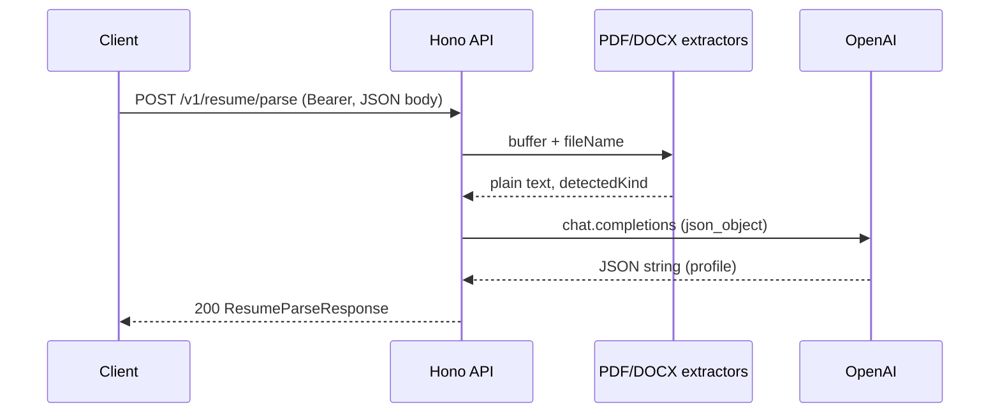
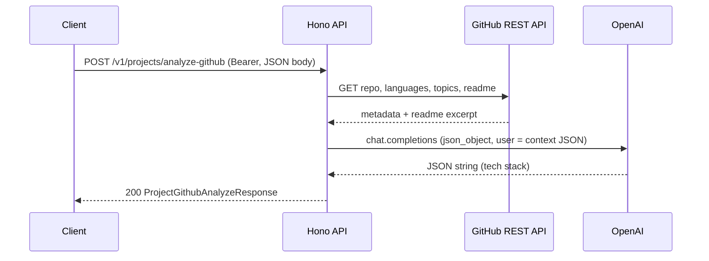
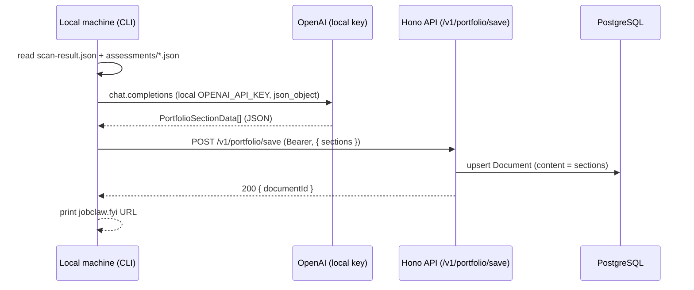

# OpenAI + Hono: resume and GitHub extraction

This document describes how the **Team 7 API** (Hono) uses **OpenAI** to return structured **JSON** from (1) a resume file and (2) a public GitHub repository URL. It includes **request/response shapes** (TypeScript types), **HTTP calls**, and **status codes**.

Live OpenAPI (Scalar): `{API_BASE}/ui` (e.g. `http://localhost:3001/ui`). Machine-readable spec: `{API_BASE}/doc`.

---

## Shared concepts

### Authentication

All routes below live under **`/v1/*`** and require the same bearer token as the rest of the API:

```http
Authorization: Bearer <supabase_access_token>
```

The server validates the JWT with **Supabase** (`getUser`). Without a valid token you get **401** with `{ "message": "..." }`.

### Error body shape

Most error responses use:

```ts
type ApiError = { message: string };
```

Request **body validation** (Zod / OpenAPI) failures use **400** with:

```ts
type ValidationError = {
  message: 'Validation failed';
  errors: /* Zod issue objects */;
};
```

### OpenAI configuration

| Variable | Role |
|----------|------|
| `OPENAI_API_KEY` | Required for both features. If missing, routes return **503** with `OpenAI is not configured on the server.` |
| `OPENAI_MODEL` | Optional. Default: `gpt-4o-mini`. |

### OpenAI call pattern (both features)

1. Hono handler builds a **system** prompt (fixed JSON shape + rules) and a **user** message (plain text or JSON string).
2. Server calls `chat.completions.create` with `response_format: { type: 'json_object' }` and low `temperature` (0.2).
3. Assistant `content` is parsed as JSON; output is validated with **Zod** (`safeParse`). If parsing or validation fails → **502**.

The model is instructed to return a **single JSON object** (no markdown). The server still strips a `{...}` slice defensively before `JSON.parse`.

---

## 1. Resume → structured profile JSON

### End-to-end flow

1. **Client** sends `POST /v1/resume/parse` with `fileBase64` + `fileName`.
2. **Hono** decodes base64 to a `Buffer`.
3. **Document extraction** (no OpenAI yet):
   - **`.pdf`**: `pdf-parse` v2 (`PDFParse`, `getText()`, `destroy()`).
   - **`.docx`**: `mammoth` raw text.
   - **`.doc`** (legacy Word binary): **not supported** → **415**.
   - Max size **6 MiB** → **413** if exceeded.
   - Empty or unreadable extraction → **422** or **415** depending on case.
4. Text may be **truncated** to ~48k characters for the model; response includes `truncated: boolean`.
5. **OpenAI** receives system instructions + user content: `fileName` + resume plain text.
6. **Hono** validates the model output with `ResumeProfileSchema` and returns **200** with `profile` + metadata.



### API: `POST /v1/resume/parse`

| Item | Value |
|------|--------|
| **Method / path** | `POST /v1/resume/parse` |
| **Content-Type** | `application/json` |
| **Auth** | `Authorization: Bearer <token>` |

#### Request schema (`ResumeParseRequest`)

```ts
type ResumeParseRequest = {
  /** Base64-encoded file bytes (standard encoding, no data-URL prefix). */
  fileBase64: string;
  /** Must match content: use `.pdf` or `.docx` (affects parser selection). */
  fileName: string;
};
```

#### Success schema (`ResumeParseResponse`) — HTTP **200**

```ts
type ResumeParseResponse = {
  detectedKind: 'pdf' | 'docx';
  /** True if resume text was shortened before sending to OpenAI. */
  truncated: boolean;
  profile: ResumeProfile;
};

type ResumeProfile = {
  fullName?: string | null;
  headline?: string | null;
  summary?: string | null;
  location?: string | null;
  email?: string | null;
  phone?: string | null;
  links?: string[];
  yearsExperience?: number | null;
  /** Required in schema: technical/professional skills (deduped). */
  keySkills: string[];
  skillCategories?: { name: string; skills: string[] }[];
  /** Spoken languages, not programming languages. */
  languagesHuman?: string[];
  certifications?: string[];
  education?: {
    institution?: string;
    degree?: string;
    field?: string;
    endYear?: number | string;
  }[];
  workHistory?: {
    company?: string;
    title?: string;
    start?: string;
    end?: string;
    highlights?: string[];
  }[];
  confidence?: number; // 0–1 when model provides it
  notes?: string;
};
```

#### Status codes — resume parse

| Code | When |
|------|------|
| **200** | Extraction + OpenAI + Zod validation succeeded. |
| **400** | Invalid JSON body, invalid base64, or OpenAPI/Zod request validation failed (`Validation failed` + `errors`). |
| **401** | Missing/invalid bearer token. |
| **413** | Decoded file larger than 6 MiB. |
| **415** | Unsupported type (e.g. `.doc`), ambiguous file with wrong `fileName`, or extraction cannot determine format. |
| **422** | PDF/DOCX parsed but no usable text, or PDF parse failure surfaced as unprocessable. |
| **500** | Unhandled server error (e.g. Supabase not configured on auth middleware). |
| **502** | OpenAI request failed, empty model content, non-JSON reply, or JSON failed `ResumeProfileSchema`. |
| **503** | `OPENAI_API_KEY` not set. |

#### Example (`curl`)

```bash
curl -sS -X POST "${API_BASE:-http://localhost:3001}/v1/resume/parse" \
  -H "Authorization: Bearer $SUPABASE_ACCESS_TOKEN" \
  -H "Content-Type: application/json" \
  -d "{\"fileName\":\"resume.pdf\",\"fileBase64\":\"$(base64 -w0 resume.pdf)\"}"
```

---

## 2. GitHub repo URL → tech stack JSON

### End-to-end flow

1. **Client** sends `POST /v1/projects/analyze-github` with `repoUrl`.
2. **Hono** parses `owner` and `repo` from a `github.com` URL.
3. **GitHub REST API** (no OpenAI yet): repo metadata, **languages** (byte counts), **topics**, **README** body (decoded from API’s base64). Optional **`GITHUB_TOKEN`** improves rate limits and access.
4. Hono builds a **JSON-serialized context** object (URL, description, branch, `languageBytes`, `topics`, `readmeExcerpt`).
5. **OpenAI** infers a structured **tech profile** from that context (still validated strictly on the server).
6. Response merges **raw GitHub snapshot** (`github`) and **model inference** (`tech`).



### API: `POST /v1/projects/analyze-github`

| Item | Value |
|------|--------|
| **Method / path** | `POST /v1/projects/analyze-github` |
| **Content-Type** | `application/json` |
| **Auth** | `Authorization: Bearer <token>` |

#### Request schema (`ProjectGithubAnalyzeRequest`)

```ts
type ProjectGithubAnalyzeRequest = {
  /** Public https://github.com/owner/repo URL (may include trailing path; owner/repo taken from path). */
  repoUrl: string; // must be valid URL per Zod .url()
};
```

#### Success schema (`ProjectGithubAnalyzeResponse`) — HTTP **200**

```ts
type ProjectGithubAnalyzeResponse = {
  repoUrl: string;
  github: {
    owner: string;
    repo: string;
    description: string | null;
    defaultBranch: string;
    /** GitHub API language statistics: language name -> bytes of that language. */
    languageBytes: Record<string, number>;
    topics: string[];
  };
  tech: ProjectTechProfile;
};

type ProjectTechProfile = {
  primaryLanguages: string[];
  frameworksLibraries: string[];
  runtimePlatforms: string[];
  databasesStorage: string[];
  infraDevops: string[];
  testingQuality: string[];
  otherNotable?: string[];
  summary?: string;
  confidence?: number; // 0–1 when model provides it
};
```

#### Status codes — GitHub analyze

| Code | When |
|------|------|
| **200** | GitHub fetch + OpenAI + Zod validation succeeded. |
| **400** | Invalid `repoUrl` (not a URL), not a `github.com` repo URL, or request validation failed. |
| **401** | Missing/invalid bearer token. |
| **404** | GitHub reports repo not found or inaccessible without credentials. |
| **500** | Unhandled server error. |
| **502** | GitHub API non-OK (e.g. 5xx) surfaced as bad gateway, or OpenAI failure / invalid JSON / failed `ProjectTechProfileSchema`. |
| **503** | `OPENAI_API_KEY` not set. |

#### Example (`curl`)

```bash
curl -sS -X POST "${API_BASE:-http://localhost:3001}/v1/projects/analyze-github" \
  -H "Authorization: Bearer $SUPABASE_ACCESS_TOKEN" \
  -H "Content-Type: application/json" \
  -d '{"repoUrl":"https://github.com/vercel/next.js"}'
```

---

---

## 3. Local portfolio generation (CLI `publish`)

### Motivation

`POST /v1/portfolio/generate` is designed for the **web builder**: it relies on the server's `OPENAI_API_KEY` and operates on assessment records already stored in the database. The **CLI `publish` command** takes a different path — it reads assessment artifacts from the local filesystem and uses the **developer's own OpenAI API key** (resolved from the local machine) to generate portfolio section summaries before uploading them to the server.

This keeps server-side API costs out of the publish path and lets each developer use the model tier they prefer.

### Key resolution order (CLI)

1. `OPENAI_API_KEY` environment variable (wins if set).
2. `~/.jobclaw/secrets.json` — written by `jobclaw init`.
3. If neither is present → publish aborts with an error directing the user to `jobclaw doctor`.

### End-to-end flow

1. **`jobclaw publish`** reads the two local artifacts:
   - **`<repo>/.jobclaw/scan-result.json`** (from `assess` step 1)
   - **Latest `<repo>/.jobclaw/assessments/<timestamp>.json`** (from `assess` step 2)
2. CLI resolves the local OpenAI key using the order above.
3. For **each** assessment entry the CLI calls `chat.completions.create` directly — the same system prompt and `json_object` response format used by the server's generate handler — producing a `PortfolioSectionData` object per assessment.
4. CLI calls **`POST /v1/portfolio/save`** (authenticated via the stored Supabase session token) with the generated `sections` array.
5. Server persists the portfolio document under the user's profile and returns `{ documentId }`.
6. CLI prints the public URL pattern: `https://jobclaw.fyi/{github-username}/{repo-name}`.



### Output shape (per section)

Same as the server generate path — the CLI uses the identical system prompt:

```ts
type PortfolioSectionData = {
  assessmentId: string;
  repoOwner: string;
  repoName: string;
  overallScore: number;
  headline: string;   // 8–14 words, punchy, past-tense
  summary: string;    // 2–3 first-person sentences
  role: string;       // inferred engineering role
  duration: string;   // e.g. "~6 months"
  techStack: string[];
  highlights: { title: string; description: string }[];
  impact: string;
};
```

### Comparison: server generate vs. CLI local generate

| Dimension | `POST /v1/portfolio/generate` (web) | `jobclaw publish` (CLI) |
|-----------|--------------------------------------|--------------------------|
| Who calls OpenAI | Server (uses server `OPENAI_API_KEY`) | Local machine (uses `~/.jobclaw/secrets.json` or env) |
| Input source | Assessment rows from PostgreSQL | Local `.jobclaw/` JSON files |
| Auth to API | Supabase JWT (browser session) | Supabase JWT (CLI stored token) |
| Output path | Returns sections to the web builder for editing | Sends directly to `POST /v1/portfolio/save` |
| User controls model tier | No | Yes — resolved from local key/env |

### Error codes (`POST /v1/portfolio/save`)

| Code | When |
|------|------|
| **200** | Portfolio saved; returns `{ documentId }`. |
| **400** | Invalid or empty `sections` array. |
| **401** | Missing / expired bearer token. |
| **404** | Authenticated user has no `Profile` row yet. |
| **500** | Unhandled server error. |

---

## Source of truth in the repo

| Concern | Location |
|---------|----------|
| Zod / OpenAPI schemas | `apps/api/src/routes/ai-extract.schema.ts` |
| Resume route + responses | `apps/api/src/routes/ai-extract/post-resume-parse.route.ts` |
| Resume handler (OpenAI + extract) | `apps/api/src/routes/ai-extract/post-resume-parse.handler.ts` |
| GitHub route + responses | `apps/api/src/routes/ai-extract/post-project-github.route.ts` |
| GitHub handler (OpenAI + GitHub) | `apps/api/src/routes/ai-extract/post-project-github.handler.ts` |
| PDF/DOCX extraction | `apps/api/src/lib/extract-document-text.ts` |
| GitHub snapshot fetch | `apps/api/src/lib/github-repo-metadata.ts` |
| OpenAI client + model | `apps/api/src/lib/openai-client.ts` |
| Portfolio generate handler (server-side) | `apps/api/src/routes/portfolio/post-generate.handler.ts` |
| Portfolio save handler | `apps/api/src/routes/portfolio/post-save.handler.ts` |
| CLI publish logic | `apps/cli/src/lib/publish-logic.ts` |
| Env examples | `apps/api/.env.example` |

If you need **shared TypeScript types** in the Next.js app, consider re-exporting or duplicating these shapes in `packages/shared-types` so web and API stay aligned with the same field names as in `ai-extract.schema.ts`.
