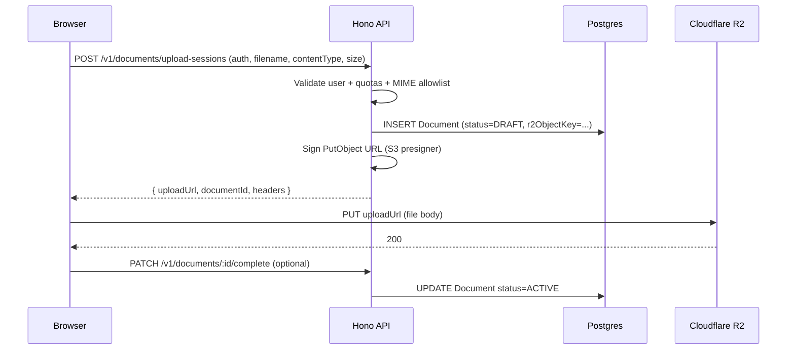
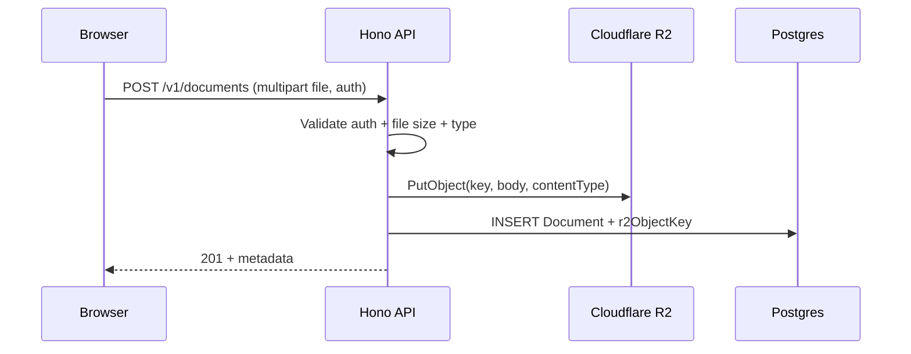

# Cloudflare R2 and the Hono API

This document explains how **user documents** can be stored in **Cloudflare R2** while the **Hono** server (`apps/api`) stays the source of truth for **auth, metadata, and business rules**.

## Can Hono store files in R2?

**Yes.** [Cloudflare R2](https://developers.cloudflare.com/r2/) exposes an **S3-compatible API**. Any Node (or edge) runtime that can call AWS S3-style endpoints can read and write objects in R2.

In this monorepo, `apps/api` runs as a **Node** process (`tsx` / `node`). The usual approach is the official [**AWS SDK for JavaScript v3**](https://docs.aws.amazon.com/sdk-for-javascript/v3/client/client-s3/) (`@aws-sdk/client-s3` and `@aws-sdk/s3-request-presigner`), pointed at R2’s endpoint with R2 API credentials.

> **If you later run Hono on Cloudflare Workers**, prefer the native [**R2 binding**](https://developers.cloudflare.com/r2/api/workers/workers-api-usage/) (`env.MY_BUCKET.put/get`) instead of the S3 client. The **data model and HTTP flows** below stay the same; only the SDK layer changes.

---

## Roles in the system

| Piece | Responsibility |
|--------|------------------|
| **Browser / Next.js** | Chooses files, calls your API, optionally uploads bytes directly to R2 when using presigned URLs. |
| **Hono API** | Verifies **Supabase JWT** (`requireAuth`), decides **who** may upload **what**, creates **DB rows** (e.g. Prisma `Document`), issues **presigned URLs** or performs **server-side** `PutObject`. |
| **PostgreSQL (Prisma)** | Stores **metadata**: filename, status, tags, **`r2ObjectKey`** (or similar), size, MIME type, `profileId` / `userId` scope. |
| **Cloudflare R2** | Stores **raw file bytes** only. |

R2 does **not** replace Postgres for listing “my documents” in the app—you still query the DB and use the stored object key when you need a download URL or server-side processing.

---

## Two integration patterns

### 1. Presigned upload (recommended for large files)

**Idea:** Hono never holds the full file in memory for long. It returns a **short-lived PUT URL**; the client uploads **directly to R2**.



**Pros:** Scales well; Hono stays small; R2 egress to the client can be cheap vs proxying through your server.  
**Cons:** You must handle **abandoned** uploads (orphan objects) with lifecycle rules or a cleanup job if the client never “completes” the session.

### 2. Proxied upload (simpler operationally)

**Idea:** Client sends **multipart/form-data** (or raw body) to Hono; Hono streams or buffers to R2 with `PutObject`.



**Pros:** One round trip from the client; easier to enforce limits in one place.  
**Cons:** File traffic and memory/CPU land on the API host; need sensible **body size limits** on Hono/your reverse proxy.

---

## Cloudflare setup (account side)

1. **Create an R2 bucket** (e.g. `team7-user-documents`).
2. **Create R2 API credentials** (S3-compatible **Access Key ID** + **Secret Access Key**) with access limited to that bucket if possible.
3. Note your **Account ID**. The S3 API endpoint is:

   `https://<ACCOUNT_ID>.r2.cloudflarestorage.com`

4. **Optional – public reads:** For public assets you can attach a **custom domain** or use **R2 public bucket** settings. For **private user docs**, keep the bucket private and use **presigned GET** URLs from Hono when the user should download.

5. **CORS on the bucket:** If the browser **PUTs directly** to R2, configure [R2 CORS](https://developers.cloudflare.com/r2/buckets/cors/) to allow your web origin, methods `PUT` (and `GET` if needed), and required headers (e.g. `Content-Type`).

---

## Hono / Node configuration

Environment variables (see `apps/api/.env.example`):

| Variable | Purpose |
|----------|---------|
| `R2_ACCOUNT_ID` | Cloudflare account ID (subdomain of R2 endpoint). |
| `R2_ACCESS_KEY_ID` | S3-compatible access key. |
| `R2_SECRET_ACCESS_KEY` | S3-compatible secret. |
| `R2_BUCKET_NAME` | Bucket name. |
| `R2_PUBLIC_URL` | Optional CDN/custom domain for public objects only. |

Example S3 client shape (conceptual):

```ts
import { S3Client } from '@aws-sdk/client-s3';

const r2 = new S3Client({
  region: 'auto',
  endpoint: `https://${process.env.R2_ACCOUNT_ID}.r2.cloudflarestorage.com`,
  credentials: {
    accessKeyId: process.env.R2_ACCESS_KEY_ID!,
    secretAccessKey: process.env.R2_SECRET_ACCESS_KEY!,
  },
});
```

Use **`PutObject`**, **`GetObject`**, **`DeleteObject`**, and **`HeadObject`** as you would on S3. For presigned URLs, use **`@aws-sdk/s3-request-presigner`** with the same client config.

---

## Mapping to this repo’s data model

`prisma/schema.prisma` already has a **`Document`** model tied to **`Profile`**. To link a row to R2, add a field such as:

- `r2ObjectKey String? @unique` — canonical key, e.g. `profiles/{profileId}/documents/{documentId}/resume.pdf`

**Naming convention:** Always prefix keys with **`profileId` or `userId`** so listing and access checks are straightforward and you never expose cross-tenant paths.

Flow:

1. Authenticated user requests upload.
2. Hono resolves `userId` → `Profile` (same as `list-documents.handler.ts`).
3. Hono generates a unique `r2ObjectKey`, creates/updates `Document`, then presigns or uploads.
4. **`GET /v1/documents`** continues to list from **Postgres**; download endpoints return presigned **GET** URLs when needed.

---

## Security checklist

- **Auth:** Only allow upload/list/delete for the **owner** (`c.get('userId')` / profile id), same pattern as existing routes.
- **Key scoping:** Keys must include tenant prefix; never accept raw bucket keys from the client without validation.
- **MIME and size:** Enforce allowlist (e.g. `application/pdf`, docx types) and max size before presigning or accepting body.
- **Presign TTL:** Keep PUT/GET URLs short-lived (minutes).
- **Secrets:** R2 keys live **only** on the server; the browser never sees them—only presigned URLs.
- **Leaks:** Prefer **private** bucket + presigned GET for downloads unless the asset is intentionally public.

---

## Summary

| Question | Answer |
|----------|--------|
| Can Hono use R2? | **Yes**, via S3-compatible API (`@aws-sdk/client-s3`) on Node, or R2 bindings on Workers. |
| Where does “my files” list come from? | **Postgres** (`Document` rows), with `r2ObjectKey` pointing at bytes in R2. |
| Best default for large uploads? | **Presigned PUT** from browser → R2, with Hono creating DB metadata and signing. |
| What does Cloudflare configure? | Bucket, API tokens, optional CORS for direct browser uploads, optional public domain for public assets. |

When you implement routes (e.g. `POST /v1/documents/upload-sessions`), register them in `apps/api/src/routes/index.ts` behind `requireAuth`, mirror types in `@team7/contracts` if you expose them to the web app, and extend Prisma with a migration for `r2ObjectKey` (or equivalent).
