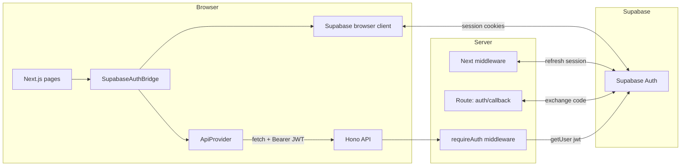
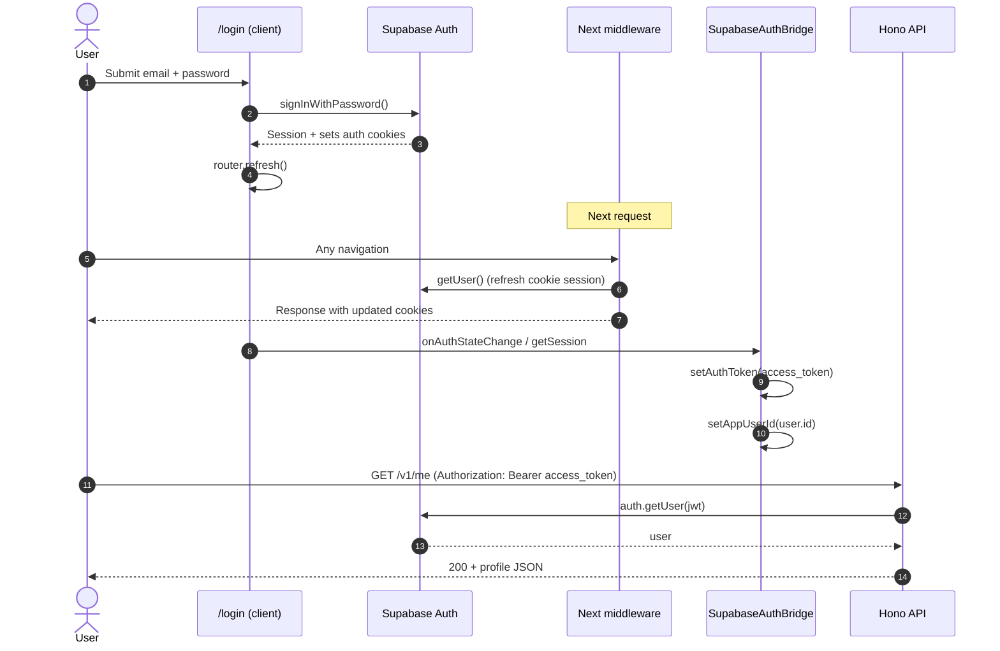
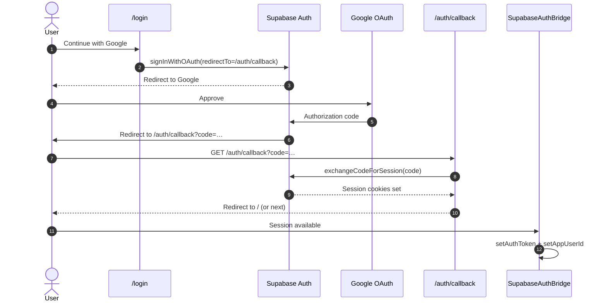
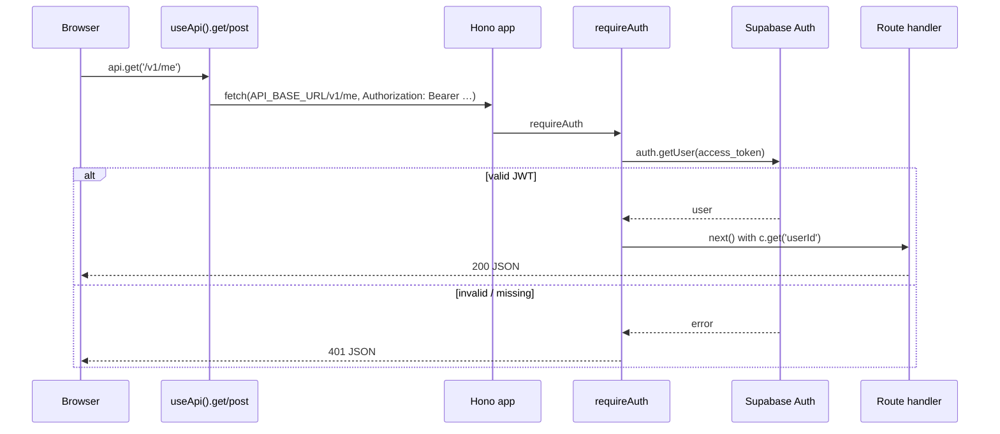
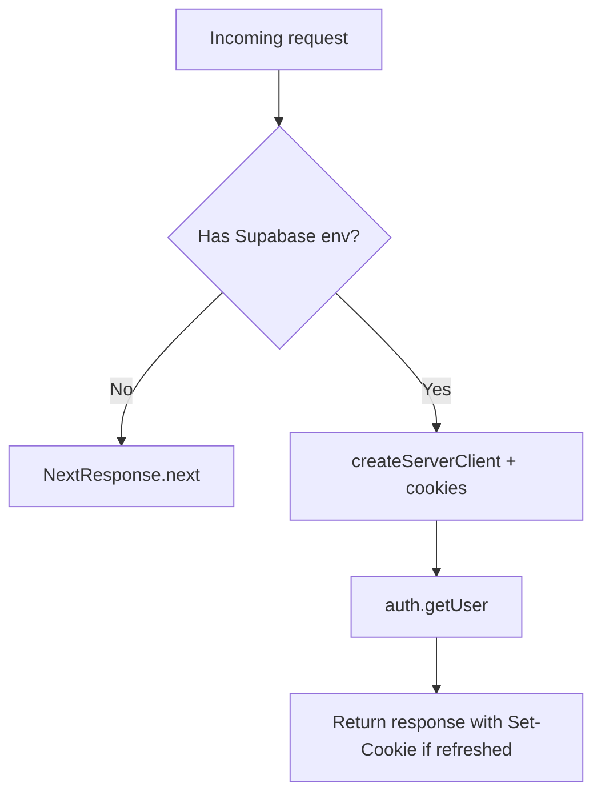

# Supabase authentication (Team 7 monorepo)

This document describes how authentication works between the **Next.js web app** (`apps/web`), **Supabase Auth**, and the **Hono API** (`apps/api`). It matches the code in this repository.

## Goals

- Users sign in through Supabase (email/password or OAuth).
- The browser holds a **session** backed by **HTTP-only cookies** (managed by `@supabase/ssr`).
- Client-side code reads `session.access_token` and sends it as **`Authorization: Bearer <jwt>`** to the API.
- The API verifies that JWT with **`supabase.auth.getUser(jwt)`** and exposes `userId` to route handlers.

## High-level architecture



## Key files

| Area | Path | Role |
|------|------|------|
| Browser Supabase client | `apps/web/lib/supabase/client.ts` | `createBrowserClient` for use in client components |
| Server Supabase client | `apps/web/lib/supabase/server.ts` | `createServerClient` for Route Handlers (e.g. OAuth callback) |
| Session refresh | `apps/web/middleware.ts` | Calls `getUser()` so short-lived sessions stay valid via cookies |
| OAuth / magic link return | `apps/web/app/auth/callback/route.ts` | `exchangeCodeForSession` then redirect |
| Login UI | `apps/web/app/login/login-form.tsx` | Sign in, sign up, Google OAuth |
| Token + RC user sync | `apps/web/lib/supabase-auth-bridge.tsx` | Pushes `access_token` → API context, `user.id` → billing/RevenueCat |
| API bearer verification | `apps/api/src/middlewares/auth.ts` | `requireAuth`: validates JWT, sets `c.set('userId', …)` |
| Protected routes | `apps/api/src/routes/index.ts` | `app.use('/v1/*', requireAuth)` before `app.openapi(...)` |

Provider order in `apps/web/app/providers.tsx`:

```text
ApiProvider → BillingProvider → SupabaseAuthBridge → children
```

The bridge must sit **inside** both `ApiProvider` and `BillingProvider` so it can call `setAuthToken` and `setAppUserId`.

---

## Flow 1: Email / password sign-in



**Important:** The JWT your API receives is **`session.access_token`**, not the Supabase “service role” key. The API uses the **same project** `SUPABASE_URL` + `SUPABASE_ANON_KEY` as the web app’s public env (same Supabase project).

---

## Flow 2: OAuth (e.g. Google)



Configure **Redirect URLs** in the Supabase dashboard (e.g. `http://localhost:3000/auth/callback` for local dev).

---

## Flow 3: Calling a protected API route



Only routes under `/v1/*` use `requireAuth` in this repo (see `apps/api/src/routes/index.ts`). Public routes like `/health`, `/example`, `/doc`, `/ui` stay unauthenticated.

---

## Session refresh (why middleware exists)

Supabase access tokens expire. The **Next.js middleware** runs on matched paths and calls `supabase.auth.getUser()`, which lets `@supabase/ssr` **rotate or refresh** the session using cookies before your RSC or API routes run.



If `NEXT_PUBLIC_SUPABASE_URL` or `NEXT_PUBLIC_SUPABASE_ANON_KEY` is missing, middleware is a no-op (useful for builds or partial setup).

---

## Sign-out

`UserMenu` (`apps/web/app/user-menu.tsx`) calls `supabase.auth.signOut()` and `router.refresh()`.  
`SupabaseAuthBridge` reacts via `onAuthStateChange`:

- `setAuthToken(null)` — clears the in-memory + `sessionStorage` API token (see `ApiProvider`).
- `setAppUserId(DEFAULT_RC_APP_USER_ID)` — resets RevenueCat’s app user unless you change that behavior.

---

## Environment variables

### Web (`apps/web/.env.local`)

| Variable | Purpose |
|----------|---------|
| `NEXT_PUBLIC_SUPABASE_URL` | Supabase project URL |
| `NEXT_PUBLIC_SUPABASE_ANON_KEY` | Supabase **anon** public key (safe in browser) |
| `NEXT_PUBLIC_API_BASE_URL` | Hono base URL (default `http://localhost:3001`) |

### API (`apps/api` env)

| Variable | Purpose |
|----------|---------|
| `SUPABASE_URL` | Same project URL as web |
| `SUPABASE_ANON_KEY` | Same **anon** key (used server-side only to call `getUser(jwt)`) |

Use the **same Supabase project** for web and API so JWTs minted for the web client validate on the API.

---

## Supabase dashboard checklist

1. **Authentication → URL configuration**
   - Site URL: your deployed origin (e.g. `http://localhost:3000` in dev).
   - Additional redirect URLs: `http://localhost:3000/auth/callback` (and production callback URL).
2. **Authentication → Providers** — enable Google (or others) if you use OAuth.
3. **Email** — configure SMTP or use Supabase defaults for sign-up confirmations if you require email verification.

---

## Troubleshooting

| Symptom | Things to check |
|---------|------------------|
| API returns `401 Unauthorized token` | JWT expired; refresh page so middleware runs; ensure header is `Bearer ` + `session.access_token`. |
| API returns `500` Supabase not configured | Set `SUPABASE_URL` and `SUPABASE_ANON_KEY` on the API process. |
| OAuth lands on error | Redirect URL must exactly match dashboard allowlist; callback route must be `/auth/callback`. |
| CORS errors from browser | API enables CORS for `http://localhost:3000` by default; set `CORS_ORIGIN` for other origins. |
| Bridge never sets token | Ensure `AppProviders` order is correct and env vars exist so `createBrowserSupabase()` does not throw silently (bridge exits early if env is missing). |

---

## Security notes

- Never expose the **service role** key in the browser.
- The **anon** key is public by design; Row Level Security (RLS) in Postgres protects data when clients talk to Supabase directly. This API instead validates the user JWT and uses its own database (Prisma) keyed by `userId`.
- Treat `access_token` like a credential: the app stores it in `sessionStorage` only as a convenience override path; the primary session is **cookies** managed by Supabase SSR.
